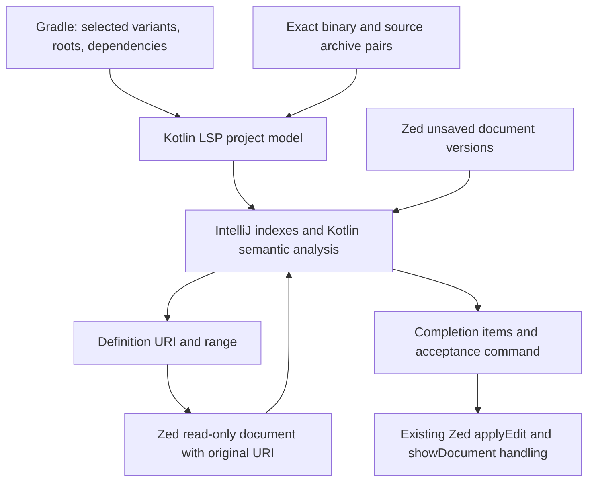

# Kotlin LSP, IntelliJ, and Android IDE implementation plan

Research date: 15 September 2026.

## Decision

**Use the official JetBrains Kotlin LSP as the preferred engine for the next implementation milestone. Keep the existing community server as a temporary, explicit fallback until the integration passes its tests.** We have now demonstrated the official engine resolving the Android sample, providing unsaved completion, opening original Compose sources, and navigating between libraries. This is a stronger basis than continuing to expand the custom compiler patch.

It is not a settings-only replacement yet. The work is primarily project-model/source attachment, virtual-document integration, correct lifecycle handling, and Compose-specific behavior. The first semantic request is still slow enough to require separate performance work.

This document updates the engine choice and implementation order in [the original deep audit](/Users/anil/.codex/worktrees/c494/zed/ANDROID_IDE_DEEP_PLAN.md). That audit retains the evidence for the existing server's failures. No product source or installed editor configuration was changed during this research.

## 1. What was inspected and tested

Three parallel research agents traced IntelliJ platform navigation/indexing, Kotlin plugin semantics, and Android Studio feature coverage. I tested the official server directly over LSP. No computer-use tools were used.

| Component | Revision / scope |
| --- | --- |
| Implemented Android IDE | Zed fork `9d130733815ae0d60ecef21a96005597e251446f`, `/Users/anil/.codex/worktrees/86df/zed` |
| Planning checkout | `/Users/anil/.codex/worktrees/c494/zed`; contains these reports |
| IntelliJ platform and Kotlin plugin | `f21a5eeb8c857a3cb23ba35e0cacf44769c86e16` |
| Official Kotlin LSP runtime | Cached standalone build `263.4702.0`; bundled product revision `d1c47ec3d7ddb` |
| Official LSP source | Public release tag `kotlin-lsp/v263.4702.0`; earlier audit also records a separate mainline snapshot |
| Android plugin / Studio | JetBrains Android `a298ed3aacaddc5573a8cec9894a19953be13c12`; Google Studio `bc887b0fe26c71212bc61c978985d7c03fedb368` |
| Test project | Temporary copy of `examples/android-ide`: AGP 9.4.0, Gradle 9.6.1, Compose compiler plugin 2.2.10, application + Android library, demo/full variants |

This is a source-backed architectural and implementation audit of the relevant subsystems, with repository inventories and targeted code tracing. It is not a claim to have reviewed every line of these very large repositories. Public mainline IntelliJ code is architectural evidence, not proof that every feature is exposed by this particular standalone server build.

The official project describes an IntelliJ-based engine, experimental Android Gradle support, and an Alpha, partially closed-source distribution. Treat public importer/plugin code, shipped LSP capabilities, and the complete Studio application as separate things. [Official Kotlin LSP README](https://github.com/Kotlin/kotlin-lsp/tree/kotlin-lsp/v263.4702.0)

### Verified protocol results

| Check | Result |
| --- | --- |
| Native Android Gradle import | Imported 9 modules and 53 libraries; selected `mobile.demoDebug` and `greeting.debug` |
| Requests before indexing finished | Compose definitions and completion could return empty; import success alone was insufficient |
| Requests after indexing | `headlineSmall`, `Text`, `padding`, `dp`, `Modifier`, `Column`, `stringResource`, and cross-module `LibraryGreeting` resolved |
| Original library sources with native import | All 53 exported libraries lacked `SOURCES` roots; Compose targets were binary `.class` URIs |
| Exact source-attachment experiment | Added 49 already-cached source archives to their matching library coordinates in the exported model; imported it through the existing JSON importer |
| Original sources after attachment | All seven Compose targets opened the correct `.kt` source archive entries, including `commonMain` and `androidMain` |
| Nested library navigation | `Typography.kt` → `TextStyle.kt` succeeded |
| Virtual document content | The advertised `decompile` command returned Kotlin text for both source-JAR and binary-JAR URIs; the returned source range selected `headlineSmall` correctly |
| Unsaved completion | Local symbol, string members, `Modifier.padding`, `MaterialTheme.typography`, `Text`, unimported `Button`, named argument `text =`, and `R.string.app_name` were available |
| Completion acceptance | Executing the completion command inserted `import androidx.compose.material3.Button` and `Button()` through `workspace/applyEdit`, followed by cursor positioning through `window/showDocument` |
| Valid Compose-context replay | Repeated the completion cases inside an explicitly `@Composable` function; the missing trailing block and low raw `text =` ranking persisted |
| Kotlin-to-Java navigation | Exact `Greeting.message` reference opened `Greeting.java`; `BuildConfig` opened generated Java; `Bundle` reached the Android SDK binary |
| Pull diagnostics | Returned diagnostics; also reported a Compose-inappropriate uppercase function-name warning for `SampleScreen` |

**Two important corrections from the experiments:**

1. The first probe stopped while indexing was still running. Its empty responses are startup/readiness evidence, not proof that Android import is unsupported.
2. The logged `Failed to call 'onVariants'` message is not reliable failure evidence: the reflection helper returns null for a successful void method, and the caller logs null as failure. The exported model contained variants and dependencies. Missing test annotation-processor output files were additional warnings; they did not prevent this sample's main-source analysis.

Sources: [Android reflection call](https://github.com/Kotlin/kotlin-lsp/blob/kotlin-lsp/v263.4702.0/workspace-import/gradle-plugin/src/com/jetbrains/ls/imports/gradle/utils/androidReflection.kt), [reflection return handling](https://github.com/Kotlin/kotlin-lsp/blob/kotlin-lsp/v263.4702.0/workspace-import/gradle-plugin/src/com/jetbrains/ls/imports/gradle/utils/reflectionUtils.kt).

### Measured latency, with limits

These are individual headless measurements on this machine, with cached dependencies/build outputs. They exclude editor input, rendering, and visible navigation. They are not p95 results or fresh-install benchmarks.

| Stage | Observed |
| --- | --- |
| Native Gradle run | Import success around 14 seconds from launch; initial indexing completed around 37 seconds. An earlier interrupted probe had already partially populated indexes. |
| JSON model with attached sources | Import success around 3.2 seconds; initial indexing around 8.1 seconds; subsequent persisted-model run reached initial index completion around 3.5 seconds |
| First `headlineSmall` after indexing | Approximately 1.49–1.73 seconds across the valid runs |
| Repeated `headlineSmall` | A few milliseconds, including 4 ms and 7 ms observations |
| Original `Typography.kt` content fetch | 6.31 ms; nested `TextStyle` definition 42.06 ms in one run |
| Binary Kotlin text fetch | 18.01 ms in one run |
| Repeat completion: padding / typography / Text / Button | Approximately 39 / 39 / 68 / 58 ms in one run |
| Repeat string-member completion | 464 ms for 495 candidates; still an optimization target |
| Named-argument completion | `text =` existed, but ranked 216th of 222 items in one request |

Attaching sources fixes correctness; it does not remove cold semantic analysis. The user's reported 5–10 second CMD-click delay still needs measurement through the actual Zed path. The JSON results demonstrate an engine capability and a possible fallback integration; they are not a fair native-import performance comparison. Completion ranks here are raw server order; Zed's filtering and ordering can change the displayed list.

## 2. What to reuse from IntelliJ



| IntelliJ mechanism | Implication for this IDE |
| --- | --- |
| Declaration action → language reference/symbol resolution → navigation element | Preserve the server's selected symbol, URI, and range; a name-to-file lookup cannot replace overload/type resolution. |
| Kotlin library module linked to its library-source module | Attach sources to the exact binary dependency and project context. Avoid searching every source archive for the same name. |
| Persistent file indexes plus PSI resolve caches | Let the engine own semantic indexes and invalidation. Reuse Zed's cancellation and document-version machinery. |
| Unsaved document overlays | Completion and navigation must analyze the currently edited text, with no save or arbitrary delay required. |
| Kotlin completion lookup elements and insertion handlers | Execute the advertised command and workspace edits. The item label is not the final text to insert. |
| Separate Android Compose contributors | Generic Kotlin completion does not automatically include Studio's Compose ranking, templates, or inspections. |

Representative implementations: [declaration dispatch](https://github.com/JetBrains/intellij-community/blob/f21a5eeb8c857a3cb23ba35e0cacf44769c86e16/platform/lang-impl/src/com/intellij/codeInsight/navigation/actions/GotoDeclarationOrUsageHandler2.kt), [Kotlin source/binary navigation](https://github.com/JetBrains/intellij-community/blob/f21a5eeb8c857a3cb23ba35e0cacf44769c86e16/plugins/kotlin/navigation/src/org/jetbrains/kotlin/idea/navigation/KotlinAnalysisApiBasedDeclarationNavigationPolicyImpl.kt), [unsaved file indexing](https://github.com/JetBrains/intellij-community/blob/f21a5eeb8c857a3cb23ba35e0cacf44769c86e16/platform/lang-impl/src/com/intellij/util/indexing/FileBasedIndexImpl.java), [K2 completion](https://github.com/JetBrains/intellij-community/blob/f21a5eeb8c857a3cb23ba35e0cacf44769c86e16/plugins/kotlin/completion/impl-k2/src/org/jetbrains/kotlin/idea/completion/impl/k2/KotlinFirCompletionContributor.kt).

## 3. Ordered implementation steps

Each step below is a reviewable work package; the larger Android features may need several PRs. Steps 1–9 establish reliable editing. Steps 10–14 establish a daily Android workflow. Steps 15–17 address broader Studio coverage and rollout. Independent work can proceed in parallel once its listed prerequisites exist.

### Step 1 — Preserve a reproducible compatibility test

**Change:** Keep the existing Android sample and protocol probe as the baseline. Add the real Zed client integration cases, including negotiated incremental edits. Record request/version, import/index progress, server errors, target URI/range, content-fetch time, and completion acceptance edits. Capture the active server release and selected build variant.

**Owners:** Existing integration tests around [LSP store](/Users/anil/.codex/worktrees/86df/zed/crates/project/src/lsp_store.rs), [editor completion](/Users/anil/.codex/worktrees/86df/zed/crates/editor/src/completions.rs), and the sample. Reuse the LSP transport's elapsed-time tracing.

**Done when:** Each currently failing behavior has a deterministic assertion; empty results, cancellation, import failure, and internal server errors are distinguishable. No arbitrary sleep makes an unsaved-completion test pass. This research provides protocol evidence; it does not complete the Zed integration tests.

### Step 2 — Add an explicit official-backend selection

**Depends on:** Step 1.

**Change:** Reuse the Kotlin extension's existing `kotlin-lsp` server identifier and launcher. Pin the tested release, keep one active Kotlin backend, and give it persistent per-workspace indexes. Configure the project JDK separately from the server runtime: this distribution requires Java 25 and bundles its runtime; the tested Android Gradle import used JDK 21. Use the supported initialization options for projects/JDKs rather than reusing fwcd's `kotlin.externalSources` settings.

**Owners:** [Android Kotlin installer](/Users/anil/.codex/worktrees/86df/zed/script/install-android-kotlin), [Android settings/setup](/Users/anil/.codex/worktrees/86df/zed/crates/android_ui/src/android_ui.rs:1694), Kotlin extension adapter and settings.

**Done when:** Fresh install, restart, offline cached start, and explicit fallback work. Backend identity/version is visible. Existing user settings survive. Do not switch the default before steps 3–9 pass.

### Step 3 — Make one selected project model drive code assistance

**Depends on:** Step 2.

**Change:** Prefer the native official Gradle importer. Coordinate its selected variants with the Android panel, source roots, dependency edges, generated code, JVM/Kotlin options, and tests. Import must still provide useful editing when application source has a compile error. Remove the setup dependency on successfully assembling the application; schedule only required generation tasks, and surface degraded generated-symbol support if those fail.

The official importer recognizes `lsp.android.variant` / `LSP_ANDROID_VARIANT`, but a single name is not a complete multi-module variant contract. Validate application flavors and dependent-library fallbacks separately. Dependency/build-script/variant changes must refresh the model and relevant servers automatically, with atomic publication of the new model.

**Owners:** [Android panel sync/setup](/Users/anil/.codex/worktrees/86df/zed/crates/android_ui/src/android_ui.rs:447), [Kotlin exporter](/Users/anil/.codex/worktrees/86df/zed/crates/android_tools/src/kotlin.rs), [Java exporter](/Users/anil/.codex/worktrees/86df/zed/crates/android_tools/src/java.rs), official importer.

**Done when:** demo/full, debug/release, app/library and test roots resolve correctly; changing a dependency or variant updates completion/navigation without rerunning setup. A broken source file does not prevent import. Duplicate classes in unrelated modules do not leak into scope.

Source: [official active-variant selection](https://github.com/Kotlin/kotlin-lsp/blob/kotlin-lsp/v263.4702.0/workspace-import/gradle-plugin/src/com/jetbrains/ls/imports/gradle/model/builder/android/androidUtils.kt).

### Step 4 — Attach original library sources to exact dependencies

**Depends on:** Step 3.

**Change:** Address the confirmed Android source-root omission. The release's Android dependency mapper constructs `CLASSES` roots from the classpath; the native sample export contained no `SOURCES` roots. Resolve source artifacts by the selected component's group/artifact/version and variant metadata, associate them with that library, and preserve Compose `commonMain`/`androidMain` entries. Handle source artifacts unavailable/offline without failing code analysis.

**Preferred delivery:** Fix or obtain the corresponding official importer behavior, then keep native import as the only production model owner. **Bounded fallback:** if the shipped importer cannot supply the required model, extend the existing Gradle export to the supported JSON workspace format with module edges, options and exact sources. The manual export → attach → JSON experiment proves this works; it is not a production recommendation to run two import pipelines on every edit. Pin and validate the JSON schema if this route is adopted.

**Owners:** [Kotlin exporter](/Users/anil/.codex/worktrees/86df/zed/crates/android_tools/src/kotlin.rs), official [Android dependency mapping](https://github.com/Kotlin/kotlin-lsp/blob/kotlin-lsp/v263.4702.0/workspace-import/src/com/jetbrains/ls/imports/gradle/SourceSetDependencyResolver.kt), [JSON importer](https://github.com/Kotlin/kotlin-lsp/blob/kotlin-lsp/v263.4702.0/workspace-import/src/com/jetbrains/ls/imports/json/JsonWorkspaceImporter.kt).

**Done when:** All seven tested Compose symbols open original sources, nested jumps work, two versions of the same library cannot cross-resolve, missing sources produce a readable binary fallback, and later source downloads invalidate the relevant targets. No global archive scan is used for overload selection.

### Step 5 — Open server-owned source and binary documents correctly

**Depends on:** Step 2; integrate with step 4.

**Change:** At the shared LSP opening path, support the actual Kotlin LSP contract: `workspace/executeCommand` with `command: "decompile"` and the original `jar:` or `jrt:` URI returns `{code, language}`. Preserve that URI, owning server, language and read-only state for subsequent requests. Reuse one buffer for the same server/session/URI; invalidate it after model or runtime changes.

The existing URI utility can convert some `jar:` URIs into paths. That is not sufficient: reading a `.class` archive entry returns binary bytes, while LSP ranges refer to the server's textual representation. JRT also is not a ZIP. Keep the existing source-archive filesystem support where it is appropriate; do not create another project/server inside a library tab.

**Owners:** [shared LSP buffer opening](/Users/anil/.codex/worktrees/86df/zed/crates/project/src/lsp_store.rs:10465), [definition target conversion](/Users/anil/.codex/worktrees/86df/zed/crates/project/src/lsp_command.rs:1980), buffer URI metadata. Touch [archive reads](/Users/anil/.codex/worktrees/86df/zed/crates/fs/src/archive.rs) only for actual filesystem needs.

**Done when:** Original source, binary fallback, Android SDK and JDK targets open readable text at the correct range; nested definition/hover, history, duplicate opens, missing entries, URI encoding, restart, and multiple workspaces work. Requests remain associated with the original document URI.

Source: [official library content provider](https://github.com/Kotlin/kotlin-lsp/blob/kotlin-lsp/v263.4702.0/vscode-extension-core/src/decompiler.ts).

### Step 6 — Complete the completion acceptance and freshness contract

**Depends on:** Steps 1–3.

**Change:** Reuse Zed's existing completion command execution, `workspace/applyEdit`, additional edits, cancellation and `window/showDocument` handling. Verify them against actual official items: an empty text edit plus `jetbrains.kotlin.completion.apply` is intentional. Preserve the command/data during resolution. Do not insert a label and then execute the server's insertion a second time.

Expose errors currently discarded during completion aggregation. Protect against stale acceptance after more typing, a second completion session, variant import or server restart. Retry only a still-current intent after a known readiness transition, when necessary; do not retry on every diagnostic notification.

**Owners:** [editor completion acceptance](/Users/anil/.codex/worktrees/86df/zed/crates/editor/src/completions.rs:1036), [completion aggregation](/Users/anil/.codex/worktrees/86df/zed/crates/project/src/lsp_store.rs:8017), existing edit/command paths.

**Done when:** Immediate unsaved local/member/import/named-argument completion works; imports, caret, undo and edits are correct; expired sessions cannot corrupt text; cancellation is quiet and internal errors are observable. Test normal typing and rapid type/backspace/accept sequences through Zed.

Source: [official completion helper](https://github.com/Kotlin/kotlin-lsp/blob/kotlin-lsp/v263.4702.0/features-impl/common/src/com/jetbrains/ls/api/features/impl/common/completion/LSCompletionProviderHelper.kt).

### Step 7 — Close the measured Compose editing gaps

**Depends on:** Step 6 and correct Compose project configuration.

**Change:** Establish whether the standalone engine can expose the required Android Compose contributors. The observed gaps are concrete: `Button()` lacks the expected trailing-lambda template; `text =` is ranked very low; a valid composable gets a function-name warning. Compare required-lambda insertion, composable-context visibility, named arguments, and `Modifier` ranking with Studio.

Prefer a small supported headless Compose integration in the engine. The Android Compose plugin depends on Android module services and multiple IntelliJ modules; copying the whole Studio plugin is not a small extension. Do not replace semantic suppression/ranking with regexes in Zed.

**Owners:** Kotlin LSP/Android Compose engine integration; Zed completion adapter only for protocol/UI behavior. Detailed implementations and registrations are linked in the Kotlin research notes below.

**Done when:** Acceptance tests cover `Button`, `Row`/`Column`, receiver lambdas, named arguments, `Modifier` extension visibility, scope receivers, normal uppercase Kotlin functions and composable functions. Preserve real compiler errors while removing Compose-specific false positives.

### Step 8 — Make cold and warm interaction meet separate budgets

**Depends on:** Steps 3–6; correctness comes first.

**Change:** Expose import/indexing progress immediately. Trace CMD-hover/click through request scheduling, server analysis, content fetch, buffer creation and visible navigation. Start the engine/import when the project needs it, retain indexes across launches, and investigate supported active-file semantic warmup after import. Use cancellable, bounded work; do not precompute every symbol or every library.

Only add a cache when the trace identifies repeat work: reuse current hover-target caching; deduplicate in-flight virtual-content fetches; cache archive directories only if measured cost warrants it. Investigate large completion result sets upstream before adding arbitrary client filtering.

Measure memory for the complete process set: Zed, Kotlin LSP, JDT LS if retained, Gradle, and the preview renderer. Include a representative larger project and a long editing/variant-switch session. Set a total-memory budget from that baseline, check sustained growth, and stop unused workspace/preview processes; moving work into another JVM does not remove its cost.

**Owners:** [hover/navigation](/Users/anil/.codex/worktrees/86df/zed/crates/editor/src/hover_links.rs), [LSP transport](/Users/anil/.codex/worktrees/86df/zed/crates/lsp/src/lsp.rs), LSP store, engine lifecycle.

**Proposed acceptance budgets:** warm end-to-end navigation p95 below 150 ms; first navigation after advertised readiness below 500 ms; warm completion p95 below 200 ms. Record hardware, workload and at least 30 samples per scenario before percentile claims. Report first import separately. Current first-analysis and string-member results do not yet meet these targets.

### Step 9 — Verify diagnostics, references and refactoring before engine promotion

**Depends on:** Steps 3–6.

**Change:** Exercise pull diagnostics, refresh, quick fixes, organize imports, references, type/implementation navigation, rename, formatting and signature help against the official server. Zed already implements pull diagnostics and enables them by default; the warning in the upstream Zed example is outdated for this fork. A feature advertised during initialization still needs a correctness test.

**Owners:** Existing [LSP commands](/Users/anil/.codex/worktrees/86df/zed/crates/project/src/lsp_command.rs), diagnostics, workspace edit and editor UI. Reuse existing preview/undo for multi-file edits.

**Done when:** Rename works across application/library sources with overloaded symbols and unsaved files; Kotlin/Java boundaries are explicitly covered; generated/read-only library targets cannot be renamed as source; stale diagnostics disappear after edits and variant changes. No capability list is treated as proof of complete refactoring parity.

### Step 10 — Keep Java and Kotlin project state consistent

**Depends on:** Steps 3 and 9.

**Change:** Retain the working Java integration while validating the official server's Java exposure independently. Kotlin resolving `Greeting.java` does not prove Java editor completion, Java→Kotlin rename, or Java debugging is ready to replace JDT LS. Choose one primary owner per language/buffer, and give both engines the same selected Android model.

**Owners:** [Java model exporter](/Users/anil/.codex/worktrees/86df/zed/crates/android_tools/src/java.rs), [Java setup](/Users/anil/.codex/worktrees/86df/zed/crates/android_ui/src/android_ui.rs:848), JDT adapter, LSP ownership.

**Done when:** Kotlin→Java and Java→Kotlin definition/references/rename work across modules; generated Java resolves; both languages update after variant changes; no duplicate diagnostics or competing completion engines appear. Consolidate engines only if these checks justify it.

### Step 11 — Add Android resource and manifest semantics

**Depends on:** Stable variant/resource model from step 3.

**Change:** Model merged resources with overlay priority, qualifiers, namespaces and dependency resources. Connect `R` references and XML references to their declarations, complete resource names/attributes and manifest classes, and support safe cross-language resource rename. `R.string.app_name` completion from a generated class is not navigation to its XML declaration.

**Owners:** Existing resource fallback in [android_resources.rs](/Users/anil/.codex/worktrees/86df/zed/crates/project/src/android_resources.rs), Android tools/model, Android UI, language integration. Reuse a suitable resource backend where possible; a generic XML server alone does not provide Android merge/variant semantics. Keep fallback lookup usable during incomplete import, with its limited scope represented accurately.

**Done when:** Application/library resources, duplicate names in overlays, qualifiers, manifest merge origins, style/theme inheritance and Kotlin/Java/XML references resolve under the selected variant. Renaming a resource updates all editable references and respects library ownership.

### Step 12 — Finish the build, device and deployment loop

**Depends on:** Step 3; largely independent of completion UI.

**Change:** Extend the existing Android panel and CLI/task integration: structured build failures with source links, cancellation, selected variant/device persistence, device disconnect/reconnect, install/launch errors and useful logcat filtering. Preserve Gradle as the build authority. Add missing AVD/SDK management workflows only after validating existing CLI coverage.

**Owners:** [Android tools](/Users/anil/.codex/worktrees/86df/zed/crates/android_tools/src/android_tools.rs), [Android panel](/Users/anil/.codex/worktrees/86df/zed/crates/android_ui/src/android_ui.rs), task and terminal infrastructure.

**Done when:** A developer can open the sample, select a variant/device, build, install, launch, inspect a failure, cancel work and recover from a disconnected device without restarting the IDE. Device/SDK discovery must not block editing readiness.

### Step 13 — Finish debugging and test feedback

**Depends on:** Steps 10 and 12.

**Change:** Build on existing DAP, JDWP forwarding and unit-test tasks. Verify breakpoints/source mapping in Kotlin, Java, inline functions and coroutines; improve attach/relaunch cleanup and process selection. Add instrumented-test execution and a structured result tree with source navigation, filtering and reruns.

**Owners:** [Android debugger](/Users/anil/.codex/worktrees/86df/zed/crates/android_ui/src/android_debugger.rs), Android tools, debugger UI, test/task results. Keep DAP and Gradle/ADB as the underlying protocols.

**Done when:** Breakpoint binding, step/evaluate, exceptions, process death/reconnect and test rerun work for app/library code on emulator and physical device. UI accurately reports unavailable coroutine/inline-debugging features rather than promising full Studio debugger parity.

### Step 14 — Make Compose preview a reliable workflow

**Depends on:** Steps 3, 7 and 12.

**Change:** Harden the existing preview renderer and source discovery: unsaved-change behavior, clear stale state, cancellation, render errors, resource/theme/device/font-scale configuration and multipreview expansion. Isolate renderer failures from the editor. Evaluate interactive preview and live editing as separate additions after static rendering is reliable.

**Owners:** [preview tooling](/Users/anil/.codex/worktrees/86df/zed/crates/android_tools/src/preview.rs), [renderer bridge](/Users/anil/.codex/worktrees/86df/zed/crates/android_tools/src/PreviewBridge.java), and [preview UI](/Users/anil/.codex/worktrees/86df/zed/crates/android_ui/src/android_preview.rs).

**Done when:** Real project previews render reliably across dependencies/resources and variants; errors link to source; rapid edits cancel stale renders; a broken preview does not hang code navigation. Do not label screenshot rendering as interactive preview or Live Edit.

### Step 15 — Bring lint and build artifacts into the editor

**Depends on:** Steps 11–13.

**Change:** Convert the existing lint command into useful editor diagnostics and result navigation; respect baselines and suppressions. Add inspection of merged manifest/resources and packaged artifacts where the current workflow lacks it. Start with links or structured viewers backed by existing Android tooling before building full Studio-style panels.

**Owners:** Android lint/build result parsing, diagnostics UI, artifact views.

**Done when:** Variant-specific lint and build issues link to correct files, stale results clear, baseline behavior matches CLI, and developers can inspect the manifest/artifact actually deployed. Keep semantic quick fixes distinct from plain lint report display.

### Step 16 — Add deeper inspection tools by workflow priority

**Depends on:** A reliable daily workflow from steps 10–15.

**Change:** Treat CPU/memory/Compose profiling, layout inspection, database/network inspection, APK analysis, device file browsing and advanced emulator controls as separate products with their own backends. Initially integrate existing Android/Perfetto/profiler tools and artifacts; build native UI only for workflows that need tighter editing integration.

**Owners:** Individual Android tool integrations and existing external-tool/artifact opening paths.

For NDK projects, separately import CMake/ABI compile commands into existing clangd support and verify LLDB/native symbols before attempting mixed JVM/native debugging. Build on SDK/bundletool tooling for release splits and artifact inspection.

**Done when:** Each claimed capability has an end-to-end target-device test and documented supported operations. A launch button for an external profiler is useful integration, but is not equivalent to Studio's entire profiler or inspector suite.

### Step 17 — Promote the backend and remove obsolete machinery

**Depends on:** Steps 1–9 for the editing milestone; steps 10–15 for daily-Android claims. Step 16 need not block an honest earlier release.

**Change:** Make the official backend the default for new Android setup once correctness and performance gates pass. Migrate generated settings deliberately; preserve explicit user choices and a rollback. Then remove the old compiler patch, flat classpath hooks and duplicate source extraction only where replacement coverage exists. Verify packaged runtime acquisition, update behavior, platform support and applicable distribution terms for the actual binary.

**Owners:** Installer, Android setup/settings, release scripts, migration tests and documentation.

**Done when:** Clean install, upgrade, offline use, restart, multiple workspaces, failure recovery and rollback pass on supported platforms. Include a second, larger Android project with test-only dependencies, convention plugins or an included build, and generated sources. Report the actual support tier. Publish no "Android Studio replacement" claim that implies unimplemented layout, profiler, inspector or refactoring capabilities.

## 4. Release milestones and dependency order

| Milestone | Required outcome | Steps |
| --- | --- | --- |
| A: Reliable Kotlin/Compose editing | Current unsaved text, correct original/decompiled library navigation, actionable readiness/errors, reliable completion acceptance, tested performance | 1–9, then the editing portion of 17 |
| B: Daily Android development | Consistent Java/Kotlin model, resources, build/run/debug/tests/logcat, dependable preview and lint | 10–15, then remaining daily-workflow rollout checks |
| C: Broader Studio replacement | Inspectors, profiling, package analysis and advanced workflows with validated coverage | 16 plus remaining gaps documented in the Android audit |

Recommended first implementation batch: **1 → 2 → 3/4 and 5 in parallel → 6/9 → 7/8 → editing rollout.** Source attachment and virtual-document work must meet before library navigation is considered complete. Broader Android work can proceed against the stable model without waiting for every performance refinement.

## 5. Evidence and detailed research

The protocol tests use full-text unsaved document changes and cached build outputs. Incremental synchronization through Zed, UI latency, clean generation, large real projects, dependency failures, all AGP versions, JRT navigation, memory growth and long sessions remain implementation validation work. The JSON source mapping used exact cached coordinates for this fixture; it is not a general dependency resolver.

- [Verified checks and limitations](/Users/anil/.codex/visualizations/2026/09/15/01a0a332-9d82-7811-8a35-7e48985d79fa/kotlin-lsp-evaluation/verification.json)
- [Native Gradle protocol results](/Users/anil/.codex/visualizations/2026/09/15/01a0a332-9d82-7811-8a35-7e48985d79fa/kotlin-lsp-evaluation/indexed-results.json)
- [Original-source and nested-navigation results](/Users/anil/.codex/visualizations/2026/09/15/01a0a332-9d82-7811-8a35-7e48985d79fa/kotlin-lsp-evaluation/with-sources-results.json)
- [Repeated completion and binary-content results](/Users/anil/.codex/visualizations/2026/09/15/01a0a332-9d82-7811-8a35-7e48985d79fa/kotlin-lsp-evaluation/repeat-results.json)
- [Corrected exact Java-reference check](/Users/anil/.codex/visualizations/2026/09/15/01a0a332-9d82-7811-8a35-7e48985d79fa/kotlin-lsp-evaluation/java-check-results.json)
- [Annotated Compose-context replay](/Users/anil/.codex/visualizations/2026/09/15/01a0a332-9d82-7811-8a35-7e48985d79fa/kotlin-lsp-evaluation/composable-results.json)
- [Probe](/Users/anil/.codex/visualizations/2026/09/15/01a0a332-9d82-7811-8a35-7e48985d79fa/kotlin-lsp-evaluation/probe.py), [evidence manifest](/Users/anil/.codex/visualizations/2026/09/15/01a0a332-9d82-7811-8a35-7e48985d79fa/kotlin-lsp-evaluation/manifest.json)
- [IntelliJ platform research](/Users/anil/.codex/visualizations/2026/09/15/01a0a332-9d82-7811-8a35-7e48985d79fa/kotlin-lsp-evaluation/platform-agent.md)
- [Kotlin and Compose semantic research](/Users/anil/.codex/visualizations/2026/09/15/01a0a332-9d82-7811-8a35-7e48985d79fa/kotlin-lsp-evaluation/kotlin-agent.md)
- [Android Studio parity research](/Users/anil/.codex/visualizations/2026/09/15/01a0a332-9d82-7811-8a35-7e48985d79fa/kotlin-lsp-evaluation/android-parity-agent.md)

The first probe's pre-index empty results and an earlier substring-based `Greeting` cursor check are retained for auditability; neither is used as a negative compatibility result. The corrected Java check selects the exact helper reference. Original fixture files remained unchanged.

## 6. Implementation ledger — 15 September 2026

Implementation is on `codex/kotlin-official-editing`, based on Android IDE commit
`9d130733815ae0d60ecef21a96005597e251446f`. The original implementation and planning
worktrees are unchanged. Community remains the default: milestone A has open
performance and lifecycle gates below.

### Implemented

| Steps | Result |
| --- | --- |
| 1–2 | Reproducible incremental UTF-16 protocol probe, explicit backend selection, persistent workspace indexes, separately configured project JDK 21 and bundled server Java 25, checksum-verified installation and fallback preservation. |
| 3–4 | Source-built patches to the pinned native Gradle importer select dependent variants from Gradle's resolved attributes, attach all source archives for exact components, and collect dynamic-feature variants. Native import remains the production model owner. |
| 3 | Managed official setup refreshes after Gradle/dependency/resource/manifest changes and variant selection; stale publication is rejected. Removed variants pause the backend until a valid selection returns. Explicit fallback, disablement, and unmanaged binary arguments survive refresh. Root-scoped restarts preserve other workspaces. |
| 3 | Resource setup checks the Gradle task graph before execution and rejects Kotlin/Java compilation. Generation failure still configures Kotlin with degraded generated-symbol support. The callback runs with configuration-cache reuse disabled. |
| 5 | Server-owned `jar:`/`jrt:` buffers retain exact URI, owner, model generation, language, and read-only state across requests, sharing, nested navigation, and pull diagnostics. In-flight opens deduplicate. Local history/reopen and database restoration refetch through the current owner; stored text is never replayed. |
| 6 | Official completion sessions track buffer/version, model, and the latest server request. Acceptance, resolve, edits, and final navigation reject expired sessions. Requests serialize around the server's global completion keys. Dropped client futures retain the server guard; uncertain timeouts fail closed for that server until restart. Errors are observable; typed cancellation stays quiet. |
| 7 | A small semantic engine contributor fixes required trailing lambdas, prioritizes named arguments in composable functions/lambdas, and suppresses only Compose-inappropriate naming inspections. Ordinary uppercase functions, unrelated annotations, callable references, and real compiler errors remain covered. |
| 9 | Live tests cover references, overloaded cross-module Kotlin rename, Kotlin-origin edits to Java usages, type/implementation navigation, diagnostics and clearing, refresh, quick fixes, organize imports, formatting, signature help, and protected targets. Java-origin references/rename remain an explicit failure boundary. |

The installed engine is **locally patched `263.4702.0+android-1`**, not an unmodified
upstream release. `script/install-android-kotlin` verifies the official archive,
public source archive, Gradle/compiler dependencies, patch source, and installed
JAR hashes. It compiles the three changed native importer source files and
`script/android-kotlin-compose.kt`, preserving the existing native importer and
feature registration. `zed-native-importer.json`, the source license, and
`SOURCE.txt` remain with the runtime. No Studio plugin bundle or client label/regex
semantic substitute is used.

### Native model and semantic evidence

- The unmodified importer selected `greeting.debug` for `mobile.fullRelease`, and
  all 53 libraries lacked source roots. The patched importer passes all 59
  required initial checks on `fullRelease`, including seven original Compose
  source targets and nested `Typography.kt` → `TextStyle.kt` navigation.
- A custom `fullStaging` application with `matchingFallbacks("release")` selects
  `greeting.release`. Adding library flavors and
  `missingDimensionStrategy("tier", "paid")` selects `greeting.paidRelease`.
  Each run passes the same 59 required checks. App/library requests for two
  versions of annotations resolve their own 23.0.0 and 13.0 source archives.
- Multiple published documentation artifacts include both main sources and
  samples. Keeping every declared source archive for the exact resolved
  component fixes the source-root-present-but-binary-navigation failure.
- The user-selected larger project was copied to `/private/tmp`; the original
  `/Users/anil/Developer/personal/nav3-recipes` retained its pre-existing
  `.idea/misc.xml` modification. It has 116 Kotlin files, approximately 10,373
  Kotlin lines (commit `bfc1fc60c36be941cb6284743cccc5a787c6d977`), Gradle 9.4.0,
  AGP 9.1.1, multiple applications, a library, and
  install-time/on-demand dynamic features. Native import now exports 26 modules
  instead of 20, adding both features' main and test source sets. `NavDisplay`
  and `Text` navigate to their exact original source archives.
- Sample resource generation succeeds despite a broken Kotlin source. On
  `nav3-recipes`, `:app:processDebugResources` transitively requests common-library
  Kotlin/Java compilation. The final guard rejects both tasks in one second,
  before any task executes. It does not disable compiler tasks and pretend their
  outputs exist. A resource/KSP-only Gradle fixture still succeeds.
- Compose engine checks pass for Button, Row/Column and receiver lambdas, annotation
  aliases, unrelated annotations, ordinary uppercase Kotlin functions, compiler
  errors, and callable-reference insertion. Raw named-argument rank improves
  from 217 to 1 in both a composable function and a typed composable lambda inside
  an ordinary host function. Only Java-origin reference/rename checks fail in
  the extended semantic run; Kotlin-origin rename updates Java usages.

Evidence: `target/kotlin-native-importer/summary.json`,
`report-all-sources`, `report-staging`, `report-flavor`,
`report-nav3-dynamic-fixed`, `nav3-resource-guard.log`, and
`resource-guard-test/{allowed,rejected}.log`; extended protocol reports under
`target/kotlin-lsp-probe/report-native-patched-extended`,
`report-native-patched-restart`, and `report-compose-semantic`.
The original failure reports remain under `target/kotlin-lsp-probe` for comparison.

### Client validation

The final deterministic suite passes **26 test functions across 444 runs** (exact
commands, counts and logs are in `target/kotlin-completion-validation/results.json`).
They use actual Zed editor/project/workspace code and fake servers. A separate
opt-in test uses `RealFs`, the actual Kotlin process, and a GPUI test window on
the larger project.

- Completion acceptance/import/caret/undo, expired sessions after typing and
  competing requests, import/restart, cross-document sessions, late edits and
  navigation, and timeout recovery pass scheduler seeds 0–19. Generic completion
  reuse, resolution, command acceptance, and showDocument behavior also pass.
- Virtual documents retain source/JRT identity, read-only sharing, deduplication,
  owner/model validation and exact diagnostic URIs. Only `file:` diagnostics enter
  filesystem buffers/caches; server-owned library diagnostics remain ignored.
  Repeated library navigation reuses the same editor through underlying buffer
  identity, avoiding duplicate tabs. History, closed-tab reopen,
  database restore with a new store/server, settings mismatch and removed owners
  are covered. Existing deserialization remains covered.
- Automatic refresh, removed variants, user fallback/disablement, latest JSON
  argument changes, root isolation, and stale restart IDs pass seeds 0–19.
- Installer fixtures cover installation, offline cached reuse, importer/Compose
  tampering, archive corruption, launcher selection and preservation. The real
  combined install and cached reinstall pass; the protocol self-test passes.

Logs live in `target/kotlin-completion-validation`,
`target/kotlin-native-importer/install-combined.log`,
`reinstall-combined.log`, and `installer-tests-combined.log`.
Clippy passes all targets/features for `android_tools`, `android_ui`, `editor`,
`project`, `language`, `proto`, `workspace`, and `remote_server`; workspace formatting
and diff checks pass. The existing `block` future-compatibility warning remains.
The opt-in live editor harness is
`test_real_kotlin_editor_completion_and_navigation` in `editor_tests.rs`.

### Performance and remaining gates

The final packaged engine run passes **116 of 118 required checks**; the two
failures are Java-origin references and rename. All 150 sampled protocol requests
succeed. On this Apple M4 (10 logical cores, 16 GiB RAM, macOS 26.6.2), with no
competing agent build/benchmark, fresh indexing takes 20.13 seconds and the first
definition takes 1,107 ms. Start load averages were 2.38 / 4.87 / 8.78.

| Packaged protocol scenario, 30 warm samples | p50 | p95 |
| --- | ---: | ---: |
| Unchanged definition | 0.49 ms | 1.17 ms |
| Modifier completion | 82.84 ms | 92.90 ms |
| String members, explicit | 244.45 ms | 286.62 ms |
| String members, dot-triggered | 224.85 ms | 266.08 ms |
| Named arguments | 178.60 ms | 216.08 ms |

These are headless request/response timings, excluding editor layout/rendering.
The report records the installed manifest and JAR hashes. Kotlin JVM RSS after
readiness/final sampling was 1.85/2.39 GiB; these are instantaneous values, not peak
or whole-IDE memory. Evidence is in
`target/kotlin-lsp-probe/report-packaged-final/results.json` and `EVIDENCE.md`.

JFR sampling points to semantic extension-scope enumeration and applicability
checking as substantial String-completion CPU work. Explicit and dot-triggered
requests both return 495 candidates, approximately 270 KB. No supported small
filter/cache fix was established. One active-file diagnostic warmup cost 1.87
seconds before a 268 ms definition; it moves the cost and does not make it free.
No extra production warmup or arbitrary completion filtering was added.

The first larger-project editor run replaced its probe function before each
sample. It passes 124 navigation/completion samples and Compose acceptance, but
those completion timings are post-replacement measurements. Its apparent 3.5 s
warm navigation delay was traced to a real duplicate-tab bug: cached library
buffers had no filesystem entry/path, so workspace lookup created another editor
on each jump. Test-only wrapping invariants amplified that cost. The shared
lookup now reuses singleton views by exact underlying model identity, with
three repeated definition jumps and existing pane-selection behavior covered.

The final separate larger-project run passes **155 samples plus Compose command
acceptance**. All 62 library jumps reuse one editor and keep exactly two tabs open.
Completion deletes/retypes only the prefix in the same function/context. All three
expected candidates rank first. Button acceptance takes 190 ms and inserts one
import, a required block, and the correct caret. Source files remain unchanged.

| Larger project, 30 repetitions after each first sample | Debug editor p50 / p95 | Wire p50 / p95 |
| --- | ---: | ---: |
| Definition after replacing source | 458 / 539 ms | 82.9 / 263.7 ms |
| Definition with unchanged source | 352 / 366 ms | 1.4 / 3.2 ms |
| String prefix refinement | 211 / 244 ms | 172.5 / 195.0 ms |
| Modifier prefix refinement | 242 / 261 ms | 197.1 / 218.0 ms |
| Named-argument prefix refinement | 637 / 784 ms | 518.9 / 659.5 ms |

Persisted-index startup reaches import/index readiness in 5.99 seconds. The first
post-edit definition is 5.47 seconds in this debug harness (1.98 seconds on the
wire). A separate bounded stack sample after the fix attributes the remaining
approximately 350 ms client interval to
`change_selections → DisplayMap::snapshot → WrapSnapshot::check_invariants` and its
nested all-row validation guarded by `#[cfg(test)]`. The final draw is about
1.8 ms. This explains test overhead; release-app cold/warm latency remains
unproven. The clean final timing run had no concurrent builds or profiling.

Final owned RSS (debug client + Kotlin JVM) is 779 MiB at readiness and 1,380 MiB
after the session; client RSS is 62/102 MiB and Kotlin 717/1,277 MiB. Shared Gradle
daemons are listed separately (1,045/171 MiB); JDT and preview are inactive.
Two snapshots over 155 operations are not a peak-memory, leak, or repeated-variant
session test. The larger full-IDE budget remains open.

Evidence: `target/kotlin-live-client-nav3-reuse/REPORT.md`, `summary.json`,
`results.json`, `protocol-timings.json`, and the separate
`target/kotlin-live-client-nav3-reuse-diagnostic/client-sample.txt`.
The earlier baseline and diagnostic runs remain in `target/kotlin-live-client-nav3`
and `target/kotlin-live-client-nav3-navigation`. Those initial measurements
included duplicate tabs and different edit preparation and are not substituted
for the final table. All GPUI measurements exclude the display compositor.

Remaining gates before default promotion:

1. Meet the cold/warm interaction budgets with controlled final engine/client
   measurements. Larger-project long-session memory and variant-switch growth,
   including active JDT and preview, still need a validated total-memory budget.
2. Restoration refetches the exact archive URI after process restart, but cannot
   prove the old archive is still in the current dependency model. It does not
   remap to a different version. Live guest tabs retain ownership/read-only state;
   restoring a closed guest tab after its host buffer disappears is unsupported.
   Filesystem recent-file pickers remain filesystem-only.
   For forwarded remote navigation, the host validates the completion session
   before forwarding and the recipient checks the buffer version before applying
   it. A later host model change can still race the recipient's UI update;
   cross-host model-epoch coordination is not implemented. Text edits remain
   guarded on the host.
3. Generated-symbol support beyond resource-only task graphs remains limited;
   projects whose generators require source compilation report degraded support.
   Broader included-build/convention-plugin and source-download invalidation cases
   need additional coverage before general Android import claims.
4. Java remains owned by JDT. Java-origin cross-language refactoring and shared
   selected-model refresh remain step 10 work. Steps 11–16 and daily-Android
   rollout have not been claimed complete.

Reproduction instructions are in
[`examples/android-ide/README.md`](examples/android-ide/README.md).

### Local commits for this increment

- `89fafc9ac2` — Native Android import/source/Compose fixes, verified installation,
  resource graph guard, and extended protocol checks.
- `dff2314a0f` — Completion freshness, library identity/restoration/diagnostics,
  tab reuse, and deterministic/live client checks.
- `49471fc0f2` — Automatic managed Android model refresh and settings preservation.

The README review notice remains for the human author's manual confirmation.

### Restart regression reported during review

The user reported project-file Cmd-click failing after reopening the app, then
working after another restart and approximately ten seconds. The attached log
showed one Kotlin server finishing import with an empty `folders` array and
library restoration receiving no document. This is a real startup-order failure,
separate from the previously measured steady-state navigation behavior.

Restoring a library tab could initialize the shared server before a project-file
tab. That path recorded the root internally but omitted the LSP workspace-folder
registration that the normal buffer path performed. Subsequent files reused the
already initialized node and did not repair it. Workspace-folder registration now
lives in the shared server creation/reuse function, replacing both caller copies.

A real-server reproduction also found that `decompile` can return null between
LSP initialization and project import completion, even with the correct root.
Restoration now waits for the pinned engine's
`intellij/workspaceImportState` `FINISHED` notification with successful folders.
It reports failed/empty imports, uses the configured LSP request timeout, and ends
the wait when the server stops. It does not add a fixed delay or retry requests.

The existing restart/history regression reproduced the empty-root failure before
the fix and passes seeds 0–19 with root registration, delayed import completion,
failed/empty imports, timeout, and shutdown coverage. Real protocol checks on the
temporary larger-project copy returned empty definitions and library content with
no workspace; with the owning root both succeeded after import/index completion.
Those checks overlapped compilation and are correctness evidence, not new latency
measurements. Reports are in `target/kotlin-restart-root` and
`target/kotlin-completion-validation/restart-{root-before,import-after}.log`.
Four shared registration/settings/library tests also pass seeds 0–19 (80 runs).
The updated real-editor smoke test passes all five first-request scenarios plus
Compose command acceptance. Clippy for `project`/`editor` and workspace formatting
pass. These follow-up logs are under `target/kotlin-restart-root`.

The user's `android:r:null` and `compile_app_classes_jar/.../classes.jar` warnings
also occurred in the successful larger-project probe. They refer to generated
resource and application class outputs that were absent; they do not explain an
empty workspace list. Generated-symbol support and cold navigation readiness
remain open gates. The implementation is under review in
[PR #21](https://github.com/anilbeesetti/zed/pull/21).

### Analysis feedback during navigation

Official Kotlin import and indexing progress now display `Analyzing project`.
Empty navigation results open a popup beside the caret instead of a workspace
notification: `Code navigation is not possible while analyzing project` while
that buffer's Kotlin server is importing or indexing, otherwise
`Cannot find declaration to go to`. Successful navigation remains available
during analysis. The popup uses the existing editor context-menu lifecycle.

All eight navigation-picker tests, seven editor navigation regressions, and the
expanded Kotlin restart/import-state test pass (16 tests). These cover empty
results, Cmd-click fallback, caret-movement dismissal, successful navigation,
import completion, and subsequent indexing. Focused Clippy for `project`,
`editor`, and `lsp_locations`, workspace formatting, and diff whitespace checks
pass. The release executable built at `dc8ce22888` predates this UI follow-up.

### Rollout validation follow-up — `263.4702.0+android-2`

The candidate fixes the reported dependency warnings at their source. AGP's
compile R generation supplies a distinct R library for each selected Android
module. A resolved project artifact is recorded as a module dependency once,
instead of also registering its absent compiled JAR as an external library.
The clean `nav3-recipes` copy imports 26 modules and six separate R libraries
without missing project-library artifacts.

Resource setup uses the native importer's resolved variant selection, including
dependent modules and test components. It requests AGP's R and BuildConfig tasks.
For dynamic features, AGP's packaged-dependency writer uses artifact identities,
but its explicit dependency also requests the artifacts' class contents. Setup
removes that unnecessary explicit dependency while retaining the writer's real
metadata input dependencies and packaging checks. The existing graph guard still
rejects source compilation before execution. Both isolated fixtures generate
their selected resources without compiling Kotlin or Java; other generators
that genuinely require compilation still report degraded support.

Java-origin references and rename now use the official engine's common semantic
providers. Explicit Java settings can attach the already registered Kotlin
extension adapter, sharing one process with Kotlin. Managed setup selects this
server for Java navigation/refactoring while retaining JDT for Java completion
and diagnostics; custom server lists are preserved. Existing managed JDT models
refresh after official setup, including selected-variant changes. That separate
Java refresh can compile sources, and failure leaves Kotlin editing configured.
Only JDT restarts after publishing its model. Native imported generated roots
are marked generated, and rename rejects generated declarations such as
BuildConfig as well as compiled library declarations.

The final engine passes 117/117 required sample correctness checks, including
Compose insertion, Java-origin method/class navigation, cross-language refactoring, generated-target protection,
module-scoped R roots, and existing project artifacts. The larger project passes
7/7 model checks. Three optional `prepareRename` probes remain unsupported and
are not advertised by the engine. These final correctness runs overlap the
release build and are not timing evidence. Installer integrity checks, seven
Android tool tests, three Android UI tests, the empty-navigation regression,
and 100 scheduler runs of shared Kotlin/Java server attachment pass. Focused
Clippy, protocol self-tests, formatting, and diff checks pass.

A separate controlled sample run before the Java declaration follow-up passed 118/118
required checks and all 150 protocol requests. With 30 samples per scenario,
p95 was 1.16 ms for warm definition, 126.83 ms for unsaved Modifier completion,
365.99 ms for explicit String completion, 312.50 ms for dot-triggered String
completion, and 296.87 ms for named arguments. First navigation after indexing
took 1,565.26 ms. These measurements exclude editor input and rendering and do
not meet all proposed budgets. A separate bounded JFR recording attributes most
String completion work to extension resolution and applicability. Moving Compose
analysis to insertion was tested and rejected because it violates Kotlin's
insertion-thread analysis rules; the proven implementation is retained.

The release UI smoke confirms both caret messages, original read-only Compose
sources, JDT completion, and one Java error that clears after undo. It also found
that Java declaration navigation still used a declaration-only provider intended
for inlay links. A protocol regression reproduced empty results for Java references
to both a Kotlin method and a Kotlin class. The provider now resolves reference
positions too; both checks pass in the final 117-check suite.

Explicit cross-language adapter selection initially changed Java's global default
adapter list. A failing regression reproduced the leak. It now reuses the named
adapter only in the configured project; default adapter order remains scoped to
those registered for that language. Startup/restart consults the existing project
server-assignment lookup when reopening buffers. The regression passes 100
scheduler runs, including reopening both languages after restart. All 27 LSP-store
integration tests and focused Clippy pass. The wider 407-test suite has seven Git
repository-parking failures that also reproduce in the earlier test binary;
four native filesystem tests pass outside the sandbox after stalling inside it.
The combined runs pass 397 tests, with three ignored and the seven baseline
failures above. No Git-parking changes are included.

The first release build succeeded. A later rebuild and one Java probe ran out of
disk space while writing intermediate files/indexes. Disposable validation indexes,
rejected runtimes, and the debug incremental cache were removed while retaining
reports. The Java probe then completed successfully. No performance claim uses
these build-overlapping checks.

Community remains the default. Final release UI timings and complete-process
memory results are recorded below, separately from these protocol checks.

### Release restart and timing follow-up

The release build at source commit `4f1095e8ce` confirms direct Java-to-Kotlin
navigation without JDT's duplicate decompiled result. A full app restart exposed
a library restoration race: extension language definitions were available before
their Wasm adapters registered. Restoration now waits for registration using the
configured request timeout. The expanded history/restart regression fails before
this change and passes 100 scheduler runs afterward; focused Clippy passes.

A separate close/reopen of the workspace inside the running app rejected a
library restore at the settings-fingerprint check. That restoration readiness/
identity case remains open, and the ownership guard is retained. Project-file
Kotlin navigation works after analysis.

Default keyboard navigation uses the picker handler, bypassing the initial
editor-only trace. Its direct-jump path now uses the same rendered-frame logger.
Completion tracing is confirmed active; the one 5,312 ms sample collected while
compilation ran is excluded. No cold-navigation timing is claimed from that run.
The final follow-up binary and controlled UI/memory results are recorded below.


### Final release measurements and promotion decision — 2026-09-15

The release build at source `1280189101b3097ebebf7069120fe51c63bf63f1` passed in
25m16s. Binary SHA-256 is
`18d1efdf4cb5e7cc80cff8eeb94e5ceafd03111adc39341c74cef43b25ec5e85`.
The embedded commit is its parent; `target/kotlin-rollout-validation/late-adapter-source.json`
records the exact source diff and binary identity. The native runtime is the final
`263.4702.0+android-2` package, including the Java definition-provider fix.

On the M4/16 GiB machine with the isolated larger project, official Kotlin and
JDT active, and no concurrent build/test/profiler, all 30 warm original Compose
Text navigation operations succeeded: p50 24.52 ms, p95 26.06 ms, maximum
26.58 ms. All 30 explicit String completion requests after unsaved dot edits
showed the correct menu: p50 800.27 ms, p95 961.40 ms, maximum 1,104.21 ms.
These measure the action handler through a rendered GPUI editor frame, excluding
the OS compositor. Every completion result was visually checked before the next
request. Automatic completion was disabled only for this explicit-request test,
then restored. Warm navigation passes the 150 ms target; completion fails 200 ms.

Single first observations after startup/readiness were 92.14 ms for a Java-to-Kotlin
source jump, 170.78 ms for original Compose Text, and 2,087.12 ms for String
completion. Cached indexes and startup delay make these unsuitable as cold-install
or first-after-index claims. The earlier controlled 1,565.26 ms first-after-index
protocol sample still fails the proposed 500 ms target.

The final full restart got past adapter registration but still dropped the
restored library tab when managed setup restarted Kotlin during import. The
persistence error at 19:09:51 was `The library document's language server stopped
during import`. Together with the preceding settings-fingerprint rejection, this
leaves startup settings/setup coordination open. Project-file navigation recovers
after analysis. No ownership, settings, or session guard was relaxed.

Memory was measured separately for the complete scoped process set: editor,
Kotlin, JDT, project Gradle daemon, preview and shell helpers. A 20-second idle
baseline peaked at 4,744.9 MiB RSS. A 180-second run covering debug→release→debug
twice, ten unsaved edit/Undo cycles, and Compose preview build/render/close peaked
at 5,444.2 MiB RSS. End known physical footprint was approximately 5.0 GiB in both
runs: editor 521 MiB, Kotlin about 1 GiB, JDT about 1 GiB, shared Gradle about
2.5 GiB, and a small shell. The login helper's physical footprint was unavailable
(8–10 MiB RSS, included in RSS totals). Rounded GiB readings prevent interpreting
the small apparent difference as a growth measurement. Preview JVMs were transient;
peak sampled preview RSS was 371.3 MiB. At idle there was one Kotlin JVM and one
JDT JVM plus proxy. All 37 observed editor/child PIDs exited after app quit; the
shared Gradle daemon remained.

Use 6 GiB steady and 8 GiB transient total physical footprint as provisional
budgets on this 16 GiB machine, including Gradle, JDT and preview. The short run
provides a baseline and cleanup evidence, not a long-session leak or transient
physical-peak pass. Longer repeated-session measurements remain required.

**Decision:** Keep community as the default and the official backend opt-in.
Completion/first-analysis performance, startup library restoration, longer-session
memory, current-model archive ownership, broader import/generated-source coverage,
and packaged-platform/distribution checks remain open. The requested caret popups,
analysis wording, native resource/artifact fixes, Java interoperability and adapter
registration fix are implemented and validated; no default-promotion claim is made.

Detailed methodology, raw sample links, process limits and reproduction commands
are in `target/kotlin-rollout-validation/VALIDATION.md`. Correctness counts remain
117/117 required native checks, 7/7 larger-project and 7/7 release-model checks,
100 scheduler runs for each of Java lifecycle and late-adapter library restoration,
all 27 LSP-store tests, and passing focused Clippy. The seven baseline Git-parking
failures in the wider suite remain excluded from this change.


### Persisted Kotlin library restoration coordination — 2026-09-15

The restoration path now waits for the owning workspace's initial scan and local
settings publication before comparing its saved settings fingerprint. Settings
reads publish in scan order, and pending reads cannot republish a removed
worktree's settings. Android startup waits for this same readiness before deciding
whether the workspace uses managed official Kotlin.

Managed Android sync, resource setup, and queued model refreshes publish their
existing tasks to the LSP store. Persisted restoration waits for the current task;
a newer managed setup cancels the old restoration attempt before it can use the
superseded server. Setup waits for the written settings to reach the settings
observer and for the existing restart task to finish shutdown and re-registration.
Superseded setup results cannot defeat a newer setup, and removing the owning
workspace ends the wait. Ordinary server failures still fail restoration; live
history retains its original session, server, and model identity. The settings
fingerprint, ownership checks, import-success requirement, request timeouts, and
current-model URI resolution remain enforced.

The expanded editor regression uses SQLite serialization and fresh projects and
language registries for restart, an already registered adapter with still-loading
local settings for workspace reopen, and setup-driven replacement during import.
It also covers superseded setup, changed variant settings, reimported models,
foreign sessions, failed/empty import, import timeout, and removal during pending
setup. The Android panel regression checks startup sync and late setup around an
already successful import and its replacement. Removing the coordination makes
the reopen case fail; retaining settings readiness but removing setup coordination
reproduces exactly `The library document's language server stopped during import`.

The opt-in native editor probe now accepts `restore_library_tabs: true`. It
serializes the actual original Compose `Typography.kt` location, shuts down its
owner, then restores through fresh projects and real Kotlin processes, including
an injected managed restart during import. It checks read-only ownership and exact
source text. The probe uses `263.4702.0+android-2`, an isolated larger-project copy,
RealFs, and a GPUI test window. It also retains the five navigation/completion
smoke scenarios and Compose command acceptance. This is source-level restart and
workspace lifecycle validation; a packaged application relaunch UI smoke was not
rerun, and no new latency or memory claim comes from this run.

Validation passes 100 scheduler seeds for editor persistence/restoration and 100
seeds for each of the four Android Kotlin tests (500 runs total), all ten focused
Kotlin tests, all 27 LSP-store integration tests, the native probe, protocol
self-tests, focused `./script/clippy` for `project`, `editor`, and `android_ui`,
formatting, and diff checks. Six settings integration tests pass; the seventh,
`test_project_settings_disable_parking`, fails identically in the untouched earlier
test binary and remains part of the previously recorded Git-parking baseline.

Detailed commands, results, and remaining validation limits are recorded in this
checkout's `target/kotlin-restoration-validation/VALIDATION.md`. No engine or
default-backend change is included. Community remains the default and official
remains opt-in. The earlier 117 required protocol checks, warm Compose navigation
p95 of 26.06 ms, and String completion p95 of 961.40 ms remain the recorded backend
baseline. Completion/first-analysis performance, longer-session memory,
current-dependency-model archive ownership, broader import/generated-source
coverage, and packaged-platform/distribution validation remain open promotion gates.


### First navigation immediately after readiness: historical android-3 — 2026-09-16

**Step 8 remains open: the candidate improves first navigation, but does not meet
500 ms on every recorded lifecycle or on the larger fixture's fresh import.**
The implementation starts from merged restoration baseline
`14f42531ebacdf45bb2ab4a80fb9895ca729f6e4`. These navigation measurements preceded integration of completion PR #24;
they describe the navigation-only package. Community remains the
default and the official backend remains opt-in.

The pinned `263.4702.0+android-3` candidate adds active-file preparation and fixes
three causes of lost analysis work:

- The editor sends `zed.prepareKotlinFile` after the focused Kotlin document is
  registered with a capable server, including late server attachment. A generation
  prevents stale focus/stop commands from replacing newer work. Blur, window
  deactivation and editor release stop preparation.
- The server resolves references in that open file against native analysis
  snapshots. Document changes cancel stale work; index publications are conflated.
  The command acknowledges scheduling without waiting for preparation. No target
  name or measured position is sent to it.
- Empty file invalidations retain the existing FIR session storage, including
  entries being populated by concurrent readers. Real invalidations and low-memory
  eviction retain native behavior.
- Native Gradle dependency/source archives are ordered deterministically. Re-import
  otherwise reordered identical source roots, discarding Kotlin model caches.
  Model-cache reuse additionally requires equality of the complete entity graph;
  actual model changes still rebuild the caches.

The installer builds these changes from the pinned public source and checksums
both the preparation source and patched runtime modules. It does not change the
upstream import/index readiness boundary, definition providers, source ownership,
read-only behavior, completion semantics, or JVM options.

`script/test-kotlin-lsp --navigation-only --prepare-active-file` sends preparation
after didOpen, then issues the first definition immediately after import success
and the original Indexing completion. It performs no model export, other semantic
request or sleep before that definition. First definition, original content,
launch time and separate warm samples are recorded. Every original target is
checked against the exact source-archive bytes and declaration range.

On Apple M4 / 16 GiB / macOS 26.6.2, the final packaged candidate's protocol series
used 30 fresh native processes per fixture and 30 subsequent warm requests per
process, with no concurrent build or profiler. All results, including the miss,
are retained; percentiles use nearest rank.

| Persisted indexes | Baseline first p95 | Candidate first p50 / p95 / max | First + content p95 | Warm protocol p95 | First requests <500 ms |
| --- | ---: | ---: | ---: | ---: | ---: |
| Android sample, `headlineSmall` | 1101.50 ms | 413.78 / 443.15 / 445.47 ms | 445.35 ms | 1.62 ms | 30/30 |
| nav3-recipes, original `Text` | 1832.24 ms | 356.40 / 443.39 / 686.22 ms | 445.28 ms | 2.60 ms | 29/30 |

All 60 first results and all 1,800 warm results passed original-target checks.
The nav3 miss is run `00`, not discarded or replaced. Baseline first requests
passed the same correctness checks but met 500 ms in 0/60 lifecycles.

Preparation has a startup cost. Median readiness changed from 2.788 to 2.887 s
(sample) and 3.463 to 3.585 s (nav3). Median launch-to-original-content improved
from 3.787 to 3.278 s and 5.248 to 3.941 s. Median server lifecycle CPU, including
startup and all 31 definitions but excluding the shared Gradle daemon, changed
from 12.15 to 12.78 CPU-seconds and 17.23 to 16.06 CPU-seconds.

Individual fresh-index candidate observations were 25.541 / 26.225 s to readiness
and 331.62 / 804.62 ms for first definition (sample / nav3). These are single
observations, not percentile claims. The corresponding baseline observations were
19.659 / 36.451 s and 1473.27 / 2354.47 ms. Dependencies were cached; these are not
first-install measurements. Launch timing starts at subprocess creation rather
than editor project-open or worktree scanning.

A source trace established that public diagnostics intentionally return empty
before diagnostics are enabled, so early diagnostic requests cannot do this work.
An instrumented import also confirmed identical full entity graphs were republished
as model changes. The retained failed experiments include provider consolidation,
JVM tier-1 compilation, full diagnostics, semantic-token preparation, and
cancellation on actual snapshot replacement (fresh nav3: 762.99 ms). Eager source
mapping did not remove the remaining target-resolution work in a diagnostic run;
that run overlapped a build and is excluded from performance claims.

The current Rust source passes 100 focus-lifecycle scheduler seeds, 100 library
history/restoration seeds, 29 hover-link tests, seven Go to Definition tests and
focused release/all-targets/all-features Clippy for editor and android_tools. The
packaged runtime passes 126/126 required native compatibility checks; three
unadvertised prepareRename checks remain optional/unsupported. Protocol self-test,
Python compilation, launcher syntax, Rust formatting and diff checks pass.

The newly built optimized GPUI editor probe opens and focuses the file before
readiness, invokes Go to Definition immediately afterward, and includes drawing
in the measured action. All 30 independent processes per fixture passed exact
read-only original-source selection and all 1,800 warm actions:

| Persisted indexes, optimized GPUI | First p50 / p95 / max | Warm p95 | First actions <500 ms |
| --- | ---: | ---: | ---: |
| Android sample | 251.80 / 421.37 / 427.73 ms | 18.04 ms | 30/30 |
| nav3-recipes | 375.58 / 429.32 / 438.54 ms | 24.92 ms | 30/30 |

The maximum time from the original readiness wire notification to the first
outbound definition was 8.56 / 11.08 ms. These are optimized GPUI test-window
measurements, including test invariants, rather than a packaged application's
GPU presentation timing. The earlier debug run took 2218 ms for a sample jump
whose definition request took 219 ms; it is retained as correctness evidence only.

Fresh-index native actions took 442.68 ms (sample) and 1450.06 ms (nav3). The
latter spent 1208.04 ms in the definition request and 6.40 ms fetching original
content, so server analysis remains the main fresh-import bottleneck. The first
native nav3 attempt exhausted disk during RocksDB writes and failed navigation;
its logs and failure report are retained separately from the successful retry.
Only this task's generated indexes/build files were removed to make room.

Native startup costs are also retained. Probe-start-to-readiness p50 / p95 / max
was 3.324 / 3.764 / 9.542 s for the sample and 4.914 / 11.261 / 102.662 s for nav3.
In nav3 run `29`, import succeeded at 3.345 s, but the first Indexing progress
began at 102.589 s. The cause of that gap is unresolved; no startup-latency pass
is claimed or outlier discarded. Probe-start timing includes test initialization
and is not an editor project-open benchmark.

The full optimized native compatibility/restoration probe also passes (33.96 s),
including Compose acceptance and two source restorations through new server
processes. All seven android_tools release tests pass. The final preparation
experiment, excluding import directives, still took 858.41 ms for fresh nav3 and
was not shipped.

A final diagnostic trace confirms the active file is available and two preparation
passes complete before the last fresh-index batch. That batch invalidates 27,917
files and replaces the FIR storage. Further work must examine real first-index
invalidation and subsequent analysis costs, rather than merely moving the focus
hook earlier. The instrumented run later failed a RocksDB write due to disk
exhaustion; its event ordering is retained, but its timings are excluded.

Commands, raw reports (large wire logs compressed), source/runtime hashes and
failed experiments are retained in this checkout's
`target/kotlin-first-navigation/VALIDATION.md`, `summary.json` and
`candidate-v2-summary.json`. Fresh-import nav3 latency, the persisted-index miss,
the native startup outlier, installation/project-open timing and previously open
rollout gates remain unverified or unmet. Persisted-index native action budgets
pass; the fresh-import gate remains open. No PR is merged and no successor task
is created. The README review notice is preserved.
### Kotlin completion cache lifetime and cancellation: android-3 baseline — 2026-09-15

The `263.4702.0+android-3` baseline introduced the following changes. FIR soft lazy values use
IntelliJ's native `CachedValueImpl`: the server's `CachedValuesManager` wrapper
otherwise puts even `NEVER_CHANGED` values in its per-snapshot cache, rebuilding
shared library name sets after document edits. FIR sessions retain responsibility
for invalidation, and the values remain soft references. The composite symbol
provider indexes provider names by package, preserving provider order and the
fallback for unknown names, special names, and synthetic function types. It does
not cache completion results or reuse completion session IDs. Both patched JARs
are covered by the installer integrity manifest.

Completion menus now own their documentation-resolution task. Closing or replacing
a menu cancels its remaining batch; visible documentation still resolves normally.
Previously, detached batches continued resolving hidden entries while the next
completion request was running. The server's serialized completion-session guard,
acceptance ownership, cancellation checks, and stale edit/caret rejection remain.

The real editor probe also has a release integration-test entry point, so the
editor dependency runs without `cfg(test)` wrapping invariants. It loads the Kotlin
extension's real grammar and measures input through menu rendering in a GPUI test
window, using RealFs and the actual server process. The IO recorder now buffers JSON
output: its old per-fragment disk writes inflated apparent client latency. Earlier
unbuffered measurements are superseded and are not evidence of a production client
rendering bottleneck.

A controlled larger-project run uses an isolated copy of nav3-recipes (six Android
modules, 116 Kotlin files, about 10,000 lines), app `debug`, project JDK 21 and the
server's bundled JBR 25. It edits a short unsaved Kotlin function within that
project. Each scenario records its first request separately and then all 30
immediate repeats, with no additional warm-up or excluded slow repeats. Completion
preparation deletes and retypes the prefix through editor actions. Explicit and
automatic dot requests are separate scenarios. These measurements include the
editor's input, LSP, menu and GPUI draw path; they do not measure OS presentation or
a packaged application's input pipeline.

| Scenario | android-2 warm p95 | android-3 warm p95 |
| --- | ---: | ---: |
| String members, explicit dot | 724.95 ms | 300.38 ms |
| String members, automatic dot | 586.95 ms | 159.30 ms |
| String prefixes `l` / `le` / `len` | 367.10 ms | 89.05 ms |
| Modifier prefixes `p` / `pa` | 352.62 ms | 95.19 ms |
| Named-argument prefixes `t` / `te` | 1,138.36 ms | 556.31 ms |
| Original Compose definition after edit | 200.25 ms | 56.33 ms |
| Original Compose definition unchanged | 4.84 ms | 5.97 ms |

The first definition after import/index readiness is still 1,301.97 ms, exceeding
500 ms; the first explicit String completion is 1,506.63 ms. Explicit completion's
first several repeats also remain above 200 ms, so its 30-repeat p95 gate is **not
met**. Automatic completion and warm navigation meet their respective 200/150 ms
targets in this run. A verified sequential-runner experiment, earlier JVM
compilation, additional compiler threads, and a shared Compose analysis session
did not satisfy the explicit gate and are not included. Profiles locate the
remaining work in local extension enumeration, applicability checking, lookup
creation and analysis-context setup; no additional semantic cache was added.

The 155 baseline/candidate completion responses contain identical candidate
multisets. String, prefix and modifier ordering matches exactly. Named-argument
ordering varies among ties across runs; the named-argument expectation remains
first. The full native contract passes 123 required checks, including new
String-to-Int-to-String receiver changes and unsaved extension renames. The three
optional `prepareRename` probes still report the server's unsupported method.
Original source navigation, Compose trailing-lambda insertion, import handling,
and unchanged on-disk fixtures pass. Native memory samples are editor/server RSS
snapshots only, not peak physical-footprint or long-session leak evidence.

Reproduce the release probe with `cargo test -p editor --test kotlin_latency
--features test-support,gpui/inspector --release --no-run`, then run the resulting
binary with `ZED_HEADLESS=1`, `ZED_KOTLIN_CLIENT_PROBE_CONFIG` pointing to an isolated
fixture/server configuration, and `real_kotlin_latency --ignored --nocapture`.
Editor validation passes all 57 completion tests and 100 scheduler seeds each for
the new cancellation regression and three Kotlin stale-session guards (400 runs).
All 27 LSP-store integration tests, focused `./script/clippy` for editor and
android_tools, all four Android Kotlin bootstrap tests, installer checks, and
protocol self-test pass. Detailed commands, raw samples,
wire logs, profile summaries, and integrity fingerprints are retained in `target/kotlin-completion-latency` in the validation
checkout. Community remains the default and official remains opt-in. At this
checkpoint, explicit completion and first-analysis latency remained open gates.

### Kotlin completion latency: android-4 — 2026-09-16

The `263.4702.0+android-4` candidate retains the preceding cache and session
ownership fixes. It rejects definitely unrelated extension receiver classes and
generic upper bounds before native candidate inference. Unknown types, smart
casts, callable references, dispatch receivers, primitive conversions and other
uncertain cases continue through the native checker. Native inference still
determines applicability, substitution and required receiver casts; completion
results and analysis symbols are not cached across edits.

Compiled annotation stubs can skip semantic analysis when their resolved short
name is not `Composable`; source annotations still resolve aliases. Qualified
selectors skip the Compose named-argument context check. Completion parameter
corrections run only for syntax that can require them, and context-sensitive enum
resolution reads the original file's module language settings. The native
parallel runner uses one producer on a shared coroutine dispatcher, bounding
producer work across overlapping requests while retaining ordered result
collection, analysis mode and cancellation. Pinned upstream sources and every
patched JAR are covered by installer integrity checks.

The protocol JSON encoder uses compact output. A String response with 498
candidates shrinks from about 752 KB to 268 KB without changing message values.
The patch replaces only the upstream `LSP` configuration object and retains its
public methods, serializer settings and notification/request types. The protocol
JAR is also included in the installer's integrity manifest.

Optional documentation resolution yields once so menu notifications can run
first. The menu continues to own cancellation, and acceptance resolves the chosen
item directly. This reduces discarded documentation requests during rapid menu
replacement without a fixed delay.

The release probe supports explicit-first and automatic-first request orders.
Import readiness no longer reparses completion responses after import has
completed: the unused parse cost about 3.7 ms for a 752 KB String response.
Complete wire recording and input-to-GPUI-draw timing remain. Each order was
measured once on the final installed package, with its first request separate
and all 30 immediate repeats retained. There are no extra warm-ups, paced delays
or excluded early repeats. Warm p95 is the 29th sorted value of those 30 samples.
The preceding android-3 table is historical.

**String warm p95 passes 200 ms in both request orders, and navigation after
edits passes 150 ms. Named-argument completion and first navigation remain open.**

| Scenario | Explicit-first first | Explicit-first warm p95 | Automatic-first first | Automatic-first warm p95 |
| --- | ---: | ---: | ---: | ---: |
| String members, explicit dot | 1395.16 ms | 188.91 ms | 111.79 ms | 128.81 ms |
| String members, automatic dot | 114.48 ms | 121.89 ms | 1297.82 ms | 191.83 ms |
| String prefixes `l` / `le` / `len` | 74.05 ms | 71.91 ms | 82.64 ms | 71.10 ms |
| Modifier prefixes `p` / `pa` | 263.83 ms | 65.79 ms | 248.41 ms | 67.21 ms |
| Named-argument prefixes `t` / `te` | 1901.63 ms | 455.93 ms | 2099.20 ms | 503.34 ms |
| Original Compose definition after edit | 1103.93 ms | 46.17 ms | 1058.61 ms | 64.97 ms |
| Original Compose definition unchanged | 4.85 ms | 7.04 ms | 4.44 ms | 5.46 ms |

Named-argument warm p95 is 455.93/503.34 ms. First navigation after import/index
readiness is 1103.93/1058.61 ms against 500 ms. The first String completion in each
order takes 1395.16/1297.82 ms. Individual warm repeats can exceed 200 ms: the
slowest explicit-first repeat is 301.27 ms and automatic-first is 282.95 ms;
both remain in the reported sample sets. These are GPUI draw measurements,
excluding OS presentation and packaged application input. RSS snapshots do not
establish long-session memory behavior.

The installed runtime passes 141 required native contract checks, including
receiver changes, nullable/smart-cast/generic receivers, Int/UInt/Number cases,
source annotation aliases, inferred type arguments and explicitly enabled
context-sensitive enum resolution. Three optional `prepareRename` probes remain
unsupported. Both final editor runs match all 156 candidate multisets against
published android-3 head `f69d479263`. String, prefix, modifier and acceptance
ordering matches; named-argument ties vary between processes, with the expected
named argument remaining first. Native insertion/import/caret checks and the
editor acceptance, Undo and stale-session guards pass.

All 57 editor completion tests, 400 scheduler runs for cancellation/session
guards, 27 LSP-store integration tests, four Android bootstrap tests, installer
integrity tests, protocol self-test, focused `./script/clippy`, formatting and
diff checks pass. Rust source fingerprints match the tested release binary's
sources; the installed runtime manifest matches the native patch and Compose
sources. The patch SHA-256 is
`0ddd97a697e5b340d4e89e54394854c41a9d30d3a0193e52a2590efca6f8f3e4`.

Raw reports, complete wire logs, source/runtime fingerprints and check logs are
retained under `target/kotlin-completion-latency`, in
`editor-android4-dispatcher-final-explicit`,
`editor-android4-dispatcher-final-automatic` and `contract-android4-dispatcher`.
Use the preceding release-probe command with `completion_refinement: true`,
`warm_samples: 30` and `completion_warm_samples: 30`; set `automatic_first: true`
for the second order. The final commit fingerprint is recorded with PR 24.

<details>
<summary>All 30 warm samples for the completion and navigation gates, in request order</summary>

Explicit-first — `string_explicit` (milliseconds):

```json
[301.2685, 188.912334, 174.577791, 173.237125, 166.00175, 159.428917, 152.086208, 145.894458, 152.860083, 148.8755, 138.283208, 129.617917, 146.888709, 145.556291, 127.902042, 125.46175, 125.290084, 123.184292, 125.186917, 121.946583, 118.111541, 119.255, 118.159208, 127.356625, 116.123291, 117.240916, 116.654417, 123.454083, 127.984084, 136.918833]
```

Explicit-first — `string_triggered` (milliseconds):

```json
[114.409834, 111.691541, 112.147, 119.998792, 109.009125, 108.627417, 112.314417, 112.868542, 117.05875, 115.788083, 109.167125, 107.152875, 105.919584, 106.808833, 137.71725, 111.64, 106.522667, 104.564042, 104.885458, 111.042542, 107.626541, 104.526958, 105.849125, 99.921292, 102.428167, 121.891541, 104.071417, 101.134, 101.884916, 101.080167]
```

Explicit-first — `definition_after_edit` (milliseconds):

```json
[46.173458, 106.734417, 34.279292, 34.720958, 34.108625, 35.589583, 34.426583, 34.652833, 31.702958, 32.332708, 34.390292, 31.16975, 30.941917, 29.567458, 31.461375, 30.970833, 30.84725, 31.518667, 29.848583, 30.096875, 31.036208, 31.544292, 30.249, 28.826542, 29.541917, 28.391458, 34.644041, 32.539833, 28.761209, 29.921166]
```

Automatic-first — `string_explicit` (milliseconds):

```json
[112.370958, 114.193167, 116.020792, 128.814791, 116.779166, 111.2585, 115.8875, 110.949917, 118.250416, 116.968167, 109.438667, 109.000292, 106.358916, 118.880583, 134.747916, 110.572167, 104.574292, 106.836792, 105.638458, 115.593833, 106.848083, 106.898, 104.730708, 103.700083, 108.022459, 110.190834, 99.697208, 102.043916, 102.645667, 101.324291]
```

Automatic-first — `string_triggered` (milliseconds):

```json
[282.952334, 191.831708, 177.647625, 182.754458, 160.26775, 152.152, 147.794166, 155.363375, 158.332, 143.532541, 134.235959, 127.790708, 156.308542, 140.705042, 128.477208, 126.166334, 122.414875, 129.608125, 124.854958, 127.881667, 120.934792, 118.736333, 127.961333, 130.08875, 121.971542, 123.865167, 116.768333, 115.189917, 140.607083, 119.410875]
```

Automatic-first — `definition_after_edit` (milliseconds):

```json
[64.968042, 50.19075, 48.294958, 37.185458, 46.070625, 41.800583, 36.585375, 88.683667, 37.898833, 34.884916, 34.901208, 33.279666, 33.664542, 32.604375, 31.533209, 29.649417, 31.813542, 31.515792, 31.567417, 30.097167, 30.756459, 31.352417, 29.160292, 28.194, 27.926167, 27.804208, 28.226042, 27.411209, 26.786625, 27.023791]
```

</details>


### Combined navigation and completion: android-5 — 2026-09-16

The published navigation and completion changes are integrated in
`263.4702.0+android-5`, starting from PR #25 head `0f7aa1562f` and PR #24 head
`24cd458c8d`. The preceding android-3 navigation and android-4 completion tables
are historical measurements of separate packages. They are not combined-head
validation.

The new package retains focused-file preparation, empty-invalidation and complete
model-graph cache reuse, completion cache and receiver filtering improvements,
compact protocol output, and menu-owned documentation cancellation. Navigation
probe logic now lives in the shared `crates/editor/src/test.rs` harness, preserving
the production-shaped release integration entry point and both completion request
orders. The editor opens and focuses the source before the original import/index
readiness boundary.

Installer validation covers both source patches and the final Kotlin feature JAR
after navigation and Compose are installed. Model, Java/common refactoring, FIR,
completion and protocol modules retain their individual hashes. A clean pinned
native build and its subsequent installer integrity check pass. The combined
runtime passes all 150 required native contract checks with preparation enabled,
including completion receiver/declaration freshness, context-sensitive resolution,
original sources and malformed/stale preparation commands. Three optional
unadvertised `prepareRename` cases remain unsupported. Resource-only generation
passes for both isolated fixtures, and offline installer tests reject an outdated
navigation hash as well as altered runtime modules.

The fresh-import and startup issues documented above, first completion,
named-argument latency and other rollout gates remain open. The user has requested
integration of the existing improvements with these limits documented. Community
remains the default and official remains opt-in.

The combined Rust source passes all 57 completion tests, 600 scheduler runs across
focus, documentation cancellation, three stale-session guards and library
history/restoration, all 7 Android-tools tests, and focused release/all-targets/
all-features `./script/clippy` for editor, project and android_tools. The clean
optimized build and shared release probe both pass. Full commands, fingerprints,
wire logs and failures are retained under `target/kotlin-combined-validation`.
The initial nav3 attempt retained copied machine settings pointing to an absent
old server; that pre-startup fixture failure is retained separately from its
isolated retry. No original project settings were changed.

#### Combined release editor observations

Each navigation row is one fresh editor/server process, with its first action followed by all 30 warm repeats. Completion uses one process per request order with all 30 warm repeats per scenario. These are representative integration checks, not first-request percentile series. No compiler or profiler ran during measurement. Both `debug_assertions` and `editor_unit_test_build` are false. Timings include GPUI drawing, not OS presentation or packaged application input.

| Navigation fixture / indexes | First action | Warm p95 | Readiness |
| --- | ---: | ---: | ---: |
| Sample / fresh | 350.11 ms | 11.62 ms | 21.51 s |
| Sample / persisted | 140.58 ms | 10.11 ms | 11.11 s |
| nav3 / fresh | 543.25 ms | 13.43 ms | 53.04 s |
| nav3 / persisted | 263.39 ms | 54.45 ms | 15.46 s |

| Completion scenario | Explicit-first first / warm p95 | Automatic-first first / warm p95 |
| --- | ---: | ---: |
| string_explicit | 972.79 / 245.84 ms | 103.51 / 108.81 ms |
| string_triggered | 114.06 / 128.08 ms | 944.35 / 157.92 ms |
| string_prefix | 89.99 / 74.93 ms | 66.49 / 65.22 ms |
| modifier | 206.59 / 57.99 ms | 192.96 / 56.74 ms |
| named_argument | 1825.93 / 428.55 ms | 1780.79 / 539.28 ms |
| definition_after_edit | 280.09 / 44.44 ms | 223.38 / 45.29 ms |
| definition_unchanged | 4.52 / 5.03 ms | 5.45 / 10.21 ms |

All original-source selections pass. Both completion orders pass native acceptance, import, caret, Undo and stale-session checks. The explicit-first run also passes two library restorations through fresh server processes, including restart during import. Wire logs confirm that navigation preparation was acknowledged in every run (62 requests per navigation run; 125 preparation and 156 completion requests per completion run).

**Performance limits remain open:** fresh nav3 first navigation is 543.25 ms against 500 ms. Explicit-first String warm p95 is 245.84 ms against 200 ms; the combined check does not establish the earlier android-4 String budget for this order. Automatic-first triggered String p95 is 157.92 ms, while first String requests take 972.79/944.35 ms. Named-argument p95 is 428.55/539.28 ms. All repeats, including maxima, are retained in `summary.json`. The historical startup gap remains unresolved; no startup or project-open budget pass is claimed.
