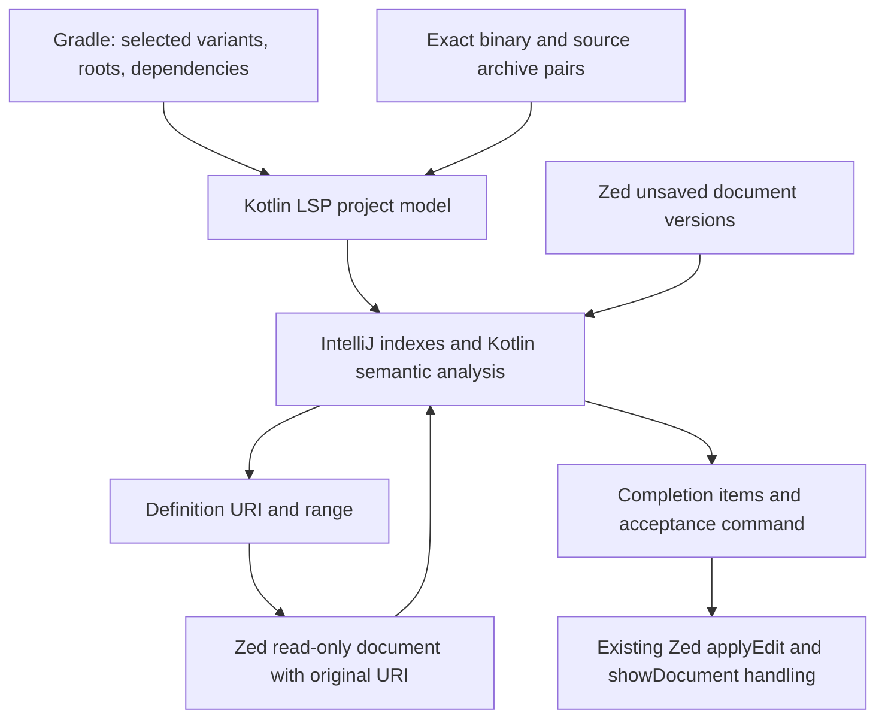

# Kotlin LSP, IntelliJ, and Android IDE implementation plan

Research date: 15 September 2026.

## Decision

**Use the official JetBrains Kotlin LSP as the preferred engine for the next implementation milestone. Keep the existing community server as a temporary, explicit fallback until the integration passes its tests.** We have now demonstrated the official engine resolving the Android sample, providing unsaved completion, opening original Compose sources, and navigating between libraries. This is a stronger basis than continuing to expand the custom compiler patch.

It is not a settings-only replacement yet. The work is primarily project-model/source attachment, virtual-document integration, correct lifecycle handling, and Compose-specific behavior. The first semantic request is still slow enough to require separate performance work.

This document updates the engine choice and implementation order in [the original deep audit](/Users/anil/.codex/worktrees/c494/zed/ANDROID_IDE_DEEP_PLAN.md). That audit retains the evidence for the existing server's failures. No product source or installed editor configuration was changed during this research.

## 1. What was inspected and tested

Three parallel research agents traced IntelliJ platform navigation/indexing, Kotlin plugin semantics, and Android Studio feature coverage. I tested the official server directly over LSP. No computer-use tools were used.

| Component | Revision / scope |
| --- | --- |
| Implemented Android IDE | Zed fork `9d130733815ae0d60ecef21a96005597e251446f`, `/Users/anil/.codex/worktrees/86df/zed` |
| Planning checkout | `/Users/anil/.codex/worktrees/c494/zed`; contains these reports |
| IntelliJ platform and Kotlin plugin | `f21a5eeb8c857a3cb23ba35e0cacf44769c86e16` |
| Official Kotlin LSP runtime | Cached standalone build `263.4702.0`; bundled product revision `d1c47ec3d7ddb` |
| Official LSP source | Public release tag `kotlin-lsp/v263.4702.0`; earlier audit also records a separate mainline snapshot |
| Android plugin / Studio | JetBrains Android `a298ed3aacaddc5573a8cec9894a19953be13c12`; Google Studio `bc887b0fe26c71212bc61c978985d7c03fedb368` |
| Test project | Temporary copy of `examples/android-ide`: AGP 9.4.0, Gradle 9.6.1, Compose compiler plugin 2.2.10, application + Android library, demo/full variants |

This is a source-backed architectural and implementation audit of the relevant subsystems, with repository inventories and targeted code tracing. It is not a claim to have reviewed every line of these very large repositories. Public mainline IntelliJ code is architectural evidence, not proof that every feature is exposed by this particular standalone server build.

The official project describes an IntelliJ-based engine, experimental Android Gradle support, and an Alpha, partially closed-source distribution. Treat public importer/plugin code, shipped LSP capabilities, and the complete Studio application as separate things. [Official Kotlin LSP README](https://github.com/Kotlin/kotlin-lsp/tree/kotlin-lsp/v263.4702.0)

### Verified protocol results

| Check | Result |
| --- | --- |
| Native Android Gradle import | Imported 9 modules and 53 libraries; selected `mobile.demoDebug` and `greeting.debug` |
| Requests before indexing finished | Compose definitions and completion could return empty; import success alone was insufficient |
| Requests after indexing | `headlineSmall`, `Text`, `padding`, `dp`, `Modifier`, `Column`, `stringResource`, and cross-module `LibraryGreeting` resolved |
| Original library sources with native import | All 53 exported libraries lacked `SOURCES` roots; Compose targets were binary `.class` URIs |
| Exact source-attachment experiment | Added 49 already-cached source archives to their matching library coordinates in the exported model; imported it through the existing JSON importer |
| Original sources after attachment | All seven Compose targets opened the correct `.kt` source archive entries, including `commonMain` and `androidMain` |
| Nested library navigation | `Typography.kt` → `TextStyle.kt` succeeded |
| Virtual document content | The advertised `decompile` command returned Kotlin text for both source-JAR and binary-JAR URIs; the returned source range selected `headlineSmall` correctly |
| Unsaved completion | Local symbol, string members, `Modifier.padding`, `MaterialTheme.typography`, `Text`, unimported `Button`, named argument `text =`, and `R.string.app_name` were available |
| Completion acceptance | Executing the completion command inserted `import androidx.compose.material3.Button` and `Button()` through `workspace/applyEdit`, followed by cursor positioning through `window/showDocument` |
| Valid Compose-context replay | Repeated the completion cases inside an explicitly `@Composable` function; the missing trailing block and low raw `text =` ranking persisted |
| Kotlin-to-Java navigation | Exact `Greeting.message` reference opened `Greeting.java`; `BuildConfig` opened generated Java; `Bundle` reached the Android SDK binary |
| Pull diagnostics | Returned diagnostics; also reported a Compose-inappropriate uppercase function-name warning for `SampleScreen` |

**Two important corrections from the experiments:**

1. The first probe stopped while indexing was still running. Its empty responses are startup/readiness evidence, not proof that Android import is unsupported.
2. The logged `Failed to call 'onVariants'` message is not reliable failure evidence: the reflection helper returns null for a successful void method, and the caller logs null as failure. The exported model contained variants and dependencies. Missing test annotation-processor output files were additional warnings; they did not prevent this sample's main-source analysis.

Sources: [Android reflection call](https://github.com/Kotlin/kotlin-lsp/blob/kotlin-lsp/v263.4702.0/workspace-import/gradle-plugin/src/com/jetbrains/ls/imports/gradle/utils/androidReflection.kt), [reflection return handling](https://github.com/Kotlin/kotlin-lsp/blob/kotlin-lsp/v263.4702.0/workspace-import/gradle-plugin/src/com/jetbrains/ls/imports/gradle/utils/reflectionUtils.kt).

### Measured latency, with limits

These are individual headless measurements on this machine, with cached dependencies/build outputs. They exclude editor input, rendering, and visible navigation. They are not p95 results or fresh-install benchmarks.

| Stage | Observed |
| --- | --- |
| Native Gradle run | Import success around 14 seconds from launch; initial indexing completed around 37 seconds. An earlier interrupted probe had already partially populated indexes. |
| JSON model with attached sources | Import success around 3.2 seconds; initial indexing around 8.1 seconds; subsequent persisted-model run reached initial index completion around 3.5 seconds |
| First `headlineSmall` after indexing | Approximately 1.49–1.73 seconds across the valid runs |
| Repeated `headlineSmall` | A few milliseconds, including 4 ms and 7 ms observations |
| Original `Typography.kt` content fetch | 6.31 ms; nested `TextStyle` definition 42.06 ms in one run |
| Binary Kotlin text fetch | 18.01 ms in one run |
| Repeat completion: padding / typography / Text / Button | Approximately 39 / 39 / 68 / 58 ms in one run |
| Repeat string-member completion | 464 ms for 495 candidates; still an optimization target |
| Named-argument completion | `text =` existed, but ranked 216th of 222 items in one request |

Attaching sources fixes correctness; it does not remove cold semantic analysis. The user's reported 5–10 second CMD-click delay still needs measurement through the actual Zed path. The JSON results demonstrate an engine capability and a possible fallback integration; they are not a fair native-import performance comparison. Completion ranks here are raw server order; Zed's filtering and ordering can change the displayed list.

## 2. What to reuse from IntelliJ

| IntelliJ mechanism | Implication for this IDE |
| --- | --- |
| Declaration action → language reference/symbol resolution → navigation element | Preserve the server's selected symbol, URI, and range; a name-to-file lookup cannot replace overload/type resolution. |
| Kotlin library module linked to its library-source module | Attach sources to the exact binary dependency and project context. Avoid searching every source archive for the same name. |
| Persistent file indexes plus PSI resolve caches | Let the engine own semantic indexes and invalidation. Reuse Zed's cancellation and document-version machinery. |
| Unsaved document overlays | Completion and navigation must analyze the currently edited text, with no save or arbitrary delay required. |
| Kotlin completion lookup elements and insertion handlers | Execute the advertised command and workspace edits. The item label is not the final text to insert. |
| Separate Android Compose contributors | Generic Kotlin completion does not automatically include Studio's Compose ranking, templates, or inspections. |

Representative implementations: [declaration dispatch](https://github.com/JetBrains/intellij-community/blob/f21a5eeb8c857a3cb23ba35e0cacf44769c86e16/platform/lang-impl/src/com/intellij/codeInsight/navigation/actions/GotoDeclarationOrUsageHandler2.kt), [Kotlin source/binary navigation](https://github.com/JetBrains/intellij-community/blob/f21a5eeb8c857a3cb23ba35e0cacf44769c86e16/plugins/kotlin/navigation/src/org/jetbrains/kotlin/idea/navigation/KotlinAnalysisApiBasedDeclarationNavigationPolicyImpl.kt), [unsaved file indexing](https://github.com/JetBrains/intellij-community/blob/f21a5eeb8c857a3cb23ba35e0cacf44769c86e16/platform/lang-impl/src/com/intellij/util/indexing/FileBasedIndexImpl.java), [K2 completion](https://github.com/JetBrains/intellij-community/blob/f21a5eeb8c857a3cb23ba35e0cacf44769c86e16/plugins/kotlin/completion/impl-k2/src/org/jetbrains/kotlin/idea/completion/impl/k2/KotlinFirCompletionContributor.kt).

## 3. Ordered implementation steps

Each step below is a reviewable work package; the larger Android features may need several PRs. Steps 1–9 establish reliable editing. Steps 10–14 establish a daily Android workflow. Steps 15–17 address broader Studio coverage and rollout. Independent work can proceed in parallel once its listed prerequisites exist.

### Step 1 — Preserve a reproducible compatibility test

**Change:** Keep the existing Android sample and protocol probe as the baseline. Add the real Zed client integration cases, including negotiated incremental edits. Record request/version, import/index progress, server errors, target URI/range, content-fetch time, and completion acceptance edits. Capture the active server release and selected build variant.

**Owners:** Existing integration tests around [LSP store](/Users/anil/.codex/worktrees/86df/zed/crates/project/src/lsp_store.rs), [editor completion](/Users/anil/.codex/worktrees/86df/zed/crates/editor/src/completions.rs), and the sample. Reuse the LSP transport's elapsed-time tracing.

**Done when:** Each currently failing behavior has a deterministic assertion; empty results, cancellation, import failure, and internal server errors are distinguishable. No arbitrary sleep makes an unsaved-completion test pass. This research provides protocol evidence; it does not complete the Zed integration tests.

### Step 2 — Add an explicit official-backend selection

**Depends on:** Step 1.

**Change:** Reuse the Kotlin extension's existing `kotlin-lsp` server identifier and launcher. Pin the tested release, keep one active Kotlin backend, and give it persistent per-workspace indexes. Configure the project JDK separately from the server runtime: this distribution requires Java 25 and bundles its runtime; the tested Android Gradle import used JDK 21. Use the supported initialization options for projects/JDKs rather than reusing fwcd's `kotlin.externalSources` settings.

**Owners:** [Android Kotlin installer](/Users/anil/.codex/worktrees/86df/zed/script/install-android-kotlin), [Android settings/setup](/Users/anil/.codex/worktrees/86df/zed/crates/android_ui/src/android_ui.rs:1694), Kotlin extension adapter and settings.

**Done when:** Fresh install, restart, offline cached start, and explicit fallback work. Backend identity/version is visible. Existing user settings survive. Do not switch the default before steps 3–9 pass.

### Step 3 — Make one selected project model drive code assistance

**Depends on:** Step 2.

**Change:** Prefer the native official Gradle importer. Coordinate its selected variants with the Android panel, source roots, dependency edges, generated code, JVM/Kotlin options, and tests. Import must still provide useful editing when application source has a compile error. Remove the setup dependency on successfully assembling the application; schedule only required generation tasks, and surface degraded generated-symbol support if those fail.

The official importer recognizes `lsp.android.variant` / `LSP_ANDROID_VARIANT`, but a single name is not a complete multi-module variant contract. Validate application flavors and dependent-library fallbacks separately. Dependency/build-script/variant changes must refresh the model and relevant servers automatically, with atomic publication of the new model.

**Owners:** [Android panel sync/setup](/Users/anil/.codex/worktrees/86df/zed/crates/android_ui/src/android_ui.rs:447), [Kotlin exporter](/Users/anil/.codex/worktrees/86df/zed/crates/android_tools/src/kotlin.rs), [Java exporter](/Users/anil/.codex/worktrees/86df/zed/crates/android_tools/src/java.rs), official importer.

**Done when:** demo/full, debug/release, app/library and test roots resolve correctly; changing a dependency or variant updates completion/navigation without rerunning setup. A broken source file does not prevent import. Duplicate classes in unrelated modules do not leak into scope.

Source: [official active-variant selection](https://github.com/Kotlin/kotlin-lsp/blob/kotlin-lsp/v263.4702.0/workspace-import/gradle-plugin/src/com/jetbrains/ls/imports/gradle/model/builder/android/androidUtils.kt).

### Step 4 — Attach original library sources to exact dependencies

**Depends on:** Step 3.

**Change:** Address the confirmed Android source-root omission. The release's Android dependency mapper constructs `CLASSES` roots from the classpath; the native sample export contained no `SOURCES` roots. Resolve source artifacts by the selected component's group/artifact/version and variant metadata, associate them with that library, and preserve Compose `commonMain`/`androidMain` entries. Handle source artifacts unavailable/offline without failing code analysis.

**Preferred delivery:** Fix or obtain the corresponding official importer behavior, then keep native import as the only production model owner. **Bounded fallback:** if the shipped importer cannot supply the required model, extend the existing Gradle export to the supported JSON workspace format with module edges, options and exact sources. The manual export → attach → JSON experiment proves this works; it is not a production recommendation to run two import pipelines on every edit. Pin and validate the JSON schema if this route is adopted.

**Owners:** [Kotlin exporter](/Users/anil/.codex/worktrees/86df/zed/crates/android_tools/src/kotlin.rs), official [Android dependency mapping](https://github.com/Kotlin/kotlin-lsp/blob/kotlin-lsp/v263.4702.0/workspace-import/src/com/jetbrains/ls/imports/gradle/SourceSetDependencyResolver.kt), [JSON importer](https://github.com/Kotlin/kotlin-lsp/blob/kotlin-lsp/v263.4702.0/workspace-import/src/com/jetbrains/ls/imports/json/JsonWorkspaceImporter.kt).

**Done when:** All seven tested Compose symbols open original sources, nested jumps work, two versions of the same library cannot cross-resolve, missing sources produce a readable binary fallback, and later source downloads invalidate the relevant targets. No global archive scan is used for overload selection.

### Step 5 — Open server-owned source and binary documents correctly

**Depends on:** Step 2; integrate with step 4.

**Change:** At the shared LSP opening path, support the actual Kotlin LSP contract: `workspace/executeCommand` with `command: "decompile"` and the original `jar:` or `jrt:` URI returns `{code, language}`. Preserve that URI, owning server, language and read-only state for subsequent requests. Reuse one buffer for the same server/session/URI; invalidate it after model or runtime changes.

The existing URI utility can convert some `jar:` URIs into paths. That is not sufficient: reading a `.class` archive entry returns binary bytes, while LSP ranges refer to the server's textual representation. JRT also is not a ZIP. Keep the existing source-archive filesystem support where it is appropriate; do not create another project/server inside a library tab.

**Owners:** [shared LSP buffer opening](/Users/anil/.codex/worktrees/86df/zed/crates/project/src/lsp_store.rs:10465), [definition target conversion](/Users/anil/.codex/worktrees/86df/zed/crates/project/src/lsp_command.rs:1980), buffer URI metadata. Touch [archive reads](/Users/anil/.codex/worktrees/86df/zed/crates/fs/src/archive.rs) only for actual filesystem needs.

**Done when:** Original source, binary fallback, Android SDK and JDK targets open readable text at the correct range; nested definition/hover, history, duplicate opens, missing entries, URI encoding, restart, and multiple workspaces work. Requests remain associated with the original document URI.

Source: [official library content provider](https://github.com/Kotlin/kotlin-lsp/blob/kotlin-lsp/v263.4702.0/vscode-extension-core/src/decompiler.ts).

### Step 6 — Complete the completion acceptance and freshness contract

**Depends on:** Steps 1–3.

**Change:** Reuse Zed's existing completion command execution, `workspace/applyEdit`, additional edits, cancellation and `window/showDocument` handling. Verify them against actual official items: an empty text edit plus `jetbrains.kotlin.completion.apply` is intentional. Preserve the command/data during resolution. Do not insert a label and then execute the server's insertion a second time.

Expose errors currently discarded during completion aggregation. Protect against stale acceptance after more typing, a second completion session, variant import or server restart. Retry only a still-current intent after a known readiness transition, when necessary; do not retry on every diagnostic notification.

**Owners:** [editor completion acceptance](/Users/anil/.codex/worktrees/86df/zed/crates/editor/src/completions.rs:1036), [completion aggregation](/Users/anil/.codex/worktrees/86df/zed/crates/project/src/lsp_store.rs:8017), existing edit/command paths.

**Done when:** Immediate unsaved local/member/import/named-argument completion works; imports, caret, undo and edits are correct; expired sessions cannot corrupt text; cancellation is quiet and internal errors are observable. Test normal typing and rapid type/backspace/accept sequences through Zed.

Source: [official completion helper](https://github.com/Kotlin/kotlin-lsp/blob/kotlin-lsp/v263.4702.0/features-impl/common/src/com/jetbrains/ls/api/features/impl/common/completion/LSCompletionProviderHelper.kt).

### Step 7 — Close the measured Compose editing gaps

**Depends on:** Step 6 and correct Compose project configuration.

**Change:** Establish whether the standalone engine can expose the required Android Compose contributors. The observed gaps are concrete: `Button()` lacks the expected trailing-lambda template; `text =` is ranked very low; a valid composable gets a function-name warning. Compare required-lambda insertion, composable-context visibility, named arguments, and `Modifier` ranking with Studio.

Prefer a small supported headless Compose integration in the engine. The Android Compose plugin depends on Android module services and multiple IntelliJ modules; copying the whole Studio plugin is not a small extension. Do not replace semantic suppression/ranking with regexes in Zed.

**Owners:** Kotlin LSP/Android Compose engine integration; Zed completion adapter only for protocol/UI behavior. Detailed implementations and registrations are linked in the Kotlin research notes below.

**Done when:** Acceptance tests cover `Button`, `Row`/`Column`, receiver lambdas, named arguments, `Modifier` extension visibility, scope receivers, normal uppercase Kotlin functions and composable functions. Preserve real compiler errors while removing Compose-specific false positives.

### Step 8 — Make cold and warm interaction meet separate budgets

**Depends on:** Steps 3–6; correctness comes first.

**Change:** Expose import/indexing progress immediately. Trace CMD-hover/click through request scheduling, server analysis, content fetch, buffer creation and visible navigation. Start the engine/import when the project needs it, retain indexes across launches, and investigate supported active-file semantic warmup after import. Use cancellable, bounded work; do not precompute every symbol or every library.

Only add a cache when the trace identifies repeat work: reuse current hover-target caching; deduplicate in-flight virtual-content fetches; cache archive directories only if measured cost warrants it. Investigate large completion result sets upstream before adding arbitrary client filtering.

Measure memory for the complete process set: Zed, Kotlin LSP, JDT LS if retained, Gradle, and the preview renderer. Include a representative larger project and a long editing/variant-switch session. Set a total-memory budget from that baseline, check sustained growth, and stop unused workspace/preview processes; moving work into another JVM does not remove its cost.

**Owners:** [hover/navigation](/Users/anil/.codex/worktrees/86df/zed/crates/editor/src/hover_links.rs), [LSP transport](/Users/anil/.codex/worktrees/86df/zed/crates/lsp/src/lsp.rs), LSP store, engine lifecycle.

**Proposed acceptance budgets:** warm end-to-end navigation p95 below 150 ms; first navigation after advertised readiness below 500 ms; warm completion p95 below 200 ms. Record hardware, workload and at least 30 samples per scenario before percentile claims. Report first import separately. Current first-analysis and string-member results do not yet meet these targets.

### Step 9 — Verify diagnostics, references and refactoring before engine promotion

**Depends on:** Steps 3–6.

**Change:** Exercise pull diagnostics, refresh, quick fixes, organize imports, references, type/implementation navigation, rename, formatting and signature help against the official server. Zed already implements pull diagnostics and enables them by default; the warning in the upstream Zed example is outdated for this fork. A feature advertised during initialization still needs a correctness test.

**Owners:** Existing [LSP commands](/Users/anil/.codex/worktrees/86df/zed/crates/project/src/lsp_command.rs), diagnostics, workspace edit and editor UI. Reuse existing preview/undo for multi-file edits.

**Done when:** Rename works across application/library sources with overloaded symbols and unsaved files; Kotlin/Java boundaries are explicitly covered; generated/read-only library targets cannot be renamed as source; stale diagnostics disappear after edits and variant changes. No capability list is treated as proof of complete refactoring parity.

### Step 10 — Keep Java and Kotlin project state consistent

**Depends on:** Steps 3 and 9.

**Change:** Retain the working Java integration while validating the official server's Java exposure independently. Kotlin resolving `Greeting.java` does not prove Java editor completion, Java→Kotlin rename, or Java debugging is ready to replace JDT LS. Choose one primary owner per language/buffer, and give both engines the same selected Android model.

**Owners:** [Java model exporter](/Users/anil/.codex/worktrees/86df/zed/crates/android_tools/src/java.rs), [Java setup](/Users/anil/.codex/worktrees/86df/zed/crates/android_ui/src/android_ui.rs:848), JDT adapter, LSP ownership.

**Done when:** Kotlin→Java and Java→Kotlin definition/references/rename work across modules; generated Java resolves; both languages update after variant changes; no duplicate diagnostics or competing completion engines appear. Consolidate engines only if these checks justify it.

### Step 11 — Add Android resource and manifest semantics

**Depends on:** Stable variant/resource model from step 3.

**Change:** Model merged resources with overlay priority, qualifiers, namespaces and dependency resources. Connect `R` references and XML references to their declarations, complete resource names/attributes and manifest classes, and support safe cross-language resource rename. `R.string.app_name` completion from a generated class is not navigation to its XML declaration.

**Owners:** Existing resource fallback in [android_resources.rs](/Users/anil/.codex/worktrees/86df/zed/crates/project/src/android_resources.rs), Android tools/model, Android UI, language integration. Reuse a suitable resource backend where possible; a generic XML server alone does not provide Android merge/variant semantics. Keep fallback lookup usable during incomplete import, with its limited scope represented accurately.

**Done when:** Application/library resources, duplicate names in overlays, qualifiers, manifest merge origins, style/theme inheritance and Kotlin/Java/XML references resolve under the selected variant. Renaming a resource updates all editable references and respects library ownership.

### Step 12 — Finish the build, device and deployment loop

**Depends on:** Step 3; largely independent of completion UI.

**Change:** Extend the existing Android panel and CLI/task integration: structured build failures with source links, cancellation, selected variant/device persistence, device disconnect/reconnect, install/launch errors and useful logcat filtering. Preserve Gradle as the build authority. Add missing AVD/SDK management workflows only after validating existing CLI coverage.

**Owners:** [Android tools](/Users/anil/.codex/worktrees/86df/zed/crates/android_tools/src/android_tools.rs), [Android panel](/Users/anil/.codex/worktrees/86df/zed/crates/android_ui/src/android_ui.rs), task and terminal infrastructure.

**Done when:** A developer can open the sample, select a variant/device, build, install, launch, inspect a failure, cancel work and recover from a disconnected device without restarting the IDE. Device/SDK discovery must not block editing readiness.

### Step 13 — Finish debugging and test feedback

**Depends on:** Steps 10 and 12.

**Change:** Build on existing DAP, JDWP forwarding and unit-test tasks. Verify breakpoints/source mapping in Kotlin, Java, inline functions and coroutines; improve attach/relaunch cleanup and process selection. Add instrumented-test execution and a structured result tree with source navigation, filtering and reruns.

**Owners:** [Android debugger](/Users/anil/.codex/worktrees/86df/zed/crates/android_ui/src/android_debugger.rs), Android tools, debugger UI, test/task results. Keep DAP and Gradle/ADB as the underlying protocols.

**Done when:** Breakpoint binding, step/evaluate, exceptions, process death/reconnect and test rerun work for app/library code on emulator and physical device. UI accurately reports unavailable coroutine/inline-debugging features rather than promising full Studio debugger parity.

### Step 14 — Make Compose preview a reliable workflow

**Depends on:** Steps 3, 7 and 12.

**Change:** Harden the existing preview renderer and source discovery: unsaved-change behavior, clear stale state, cancellation, render errors, resource/theme/device/font-scale configuration and multipreview expansion. Isolate renderer failures from the editor. Evaluate interactive preview and live editing as separate additions after static rendering is reliable.

**Owners:** [preview tooling](/Users/anil/.codex/worktrees/86df/zed/crates/android_tools/src/preview.rs), [renderer bridge](/Users/anil/.codex/worktrees/86df/zed/crates/android_tools/src/PreviewBridge.java), and [preview UI](/Users/anil/.codex/worktrees/86df/zed/crates/android_ui/src/android_preview.rs).

**Done when:** Real project previews render reliably across dependencies/resources and variants; errors link to source; rapid edits cancel stale renders; a broken preview does not hang code navigation. Do not label screenshot rendering as interactive preview or Live Edit.

### Step 15 — Bring lint and build artifacts into the editor

**Depends on:** Steps 11–13.

**Change:** Convert the existing lint command into useful editor diagnostics and result navigation; respect baselines and suppressions. Add inspection of merged manifest/resources and packaged artifacts where the current workflow lacks it. Start with links or structured viewers backed by existing Android tooling before building full Studio-style panels.

**Owners:** Android lint/build result parsing, diagnostics UI, artifact views.

**Done when:** Variant-specific lint and build issues link to correct files, stale results clear, baseline behavior matches CLI, and developers can inspect the manifest/artifact actually deployed. Keep semantic quick fixes distinct from plain lint report display.

### Step 16 — Add deeper inspection tools by workflow priority

**Depends on:** A reliable daily workflow from steps 10–15.

**Change:** Treat CPU/memory/Compose profiling, layout inspection, database/network inspection, APK analysis, device file browsing and advanced emulator controls as separate products with their own backends. Initially integrate existing Android/Perfetto/profiler tools and artifacts; build native UI only for workflows that need tighter editing integration.

**Owners:** Individual Android tool integrations and existing external-tool/artifact opening paths.

For NDK projects, separately import CMake/ABI compile commands into existing clangd support and verify LLDB/native symbols before attempting mixed JVM/native debugging. Build on SDK/bundletool tooling for release splits and artifact inspection.

**Done when:** Each claimed capability has an end-to-end target-device test and documented supported operations. A launch button for an external profiler is useful integration, but is not equivalent to Studio's entire profiler or inspector suite.

### Step 17 — Promote the backend and remove obsolete machinery

**Depends on:** Steps 1–9 for the editing milestone; steps 10–15 for daily-Android claims. Step 16 need not block an honest earlier release.

**Change:** Make the official backend the default for new Android setup once correctness and performance gates pass. Migrate generated settings deliberately; preserve explicit user choices and a rollback. Then remove the old compiler patch, flat classpath hooks and duplicate source extraction only where replacement coverage exists. Verify packaged runtime acquisition, update behavior, platform support and applicable distribution terms for the actual binary.

**Owners:** Installer, Android setup/settings, release scripts, migration tests and documentation.

**Done when:** Clean install, upgrade, offline use, restart, multiple workspaces, failure recovery and rollback pass on supported platforms. Include a second, larger Android project with test-only dependencies, convention plugins or an included build, and generated sources. Report the actual support tier. Publish no "Android Studio replacement" claim that implies unimplemented layout, profiler, inspector or refactoring capabilities.

## 4. Release milestones and dependency order

| Milestone | Required outcome | Steps |
| --- | --- | --- |
| A: Reliable Kotlin/Compose editing | Current unsaved text, correct original/decompiled library navigation, actionable readiness/errors, reliable completion acceptance, tested performance | 1–9, then the editing portion of 17 |
| B: Daily Android development | Consistent Java/Kotlin model, resources, build/run/debug/tests/logcat, dependable preview and lint | 10–15, then remaining daily-workflow rollout checks |
| C: Broader Studio replacement | Inspectors, profiling, package analysis and advanced workflows with validated coverage | 16 plus remaining gaps documented in the Android audit |

Recommended first implementation batch: **1 → 2 → 3/4 and 5 in parallel → 6/9 → 7/8 → editing rollout.** Source attachment and virtual-document work must meet before library navigation is considered complete. Broader Android work can proceed against the stable model without waiting for every performance refinement.

## 5. Evidence and detailed research

The protocol tests use full-text unsaved document changes and cached build outputs. Incremental synchronization through Zed, UI latency, clean generation, large real projects, dependency failures, all AGP versions, JRT navigation, memory growth and long sessions remain implementation validation work. The JSON source mapping used exact cached coordinates for this fixture; it is not a general dependency resolver.

- [Verified checks and limitations](/Users/anil/.codex/visualizations/2026/09/15/01a0a332-9d82-7811-8a35-7e48985d79fa/kotlin-lsp-evaluation/verification.json)
- [Native Gradle protocol results](/Users/anil/.codex/visualizations/2026/09/15/01a0a332-9d82-7811-8a35-7e48985d79fa/kotlin-lsp-evaluation/indexed-results.json)
- [Original-source and nested-navigation results](/Users/anil/.codex/visualizations/2026/09/15/01a0a332-9d82-7811-8a35-7e48985d79fa/kotlin-lsp-evaluation/with-sources-results.json)
- [Repeated completion and binary-content results](/Users/anil/.codex/visualizations/2026/09/15/01a0a332-9d82-7811-8a35-7e48985d79fa/kotlin-lsp-evaluation/repeat-results.json)
- [Corrected exact Java-reference check](/Users/anil/.codex/visualizations/2026/09/15/01a0a332-9d82-7811-8a35-7e48985d79fa/kotlin-lsp-evaluation/java-check-results.json)
- [Annotated Compose-context replay](/Users/anil/.codex/visualizations/2026/09/15/01a0a332-9d82-7811-8a35-7e48985d79fa/kotlin-lsp-evaluation/composable-results.json)
- [Probe](/Users/anil/.codex/visualizations/2026/09/15/01a0a332-9d82-7811-8a35-7e48985d79fa/kotlin-lsp-evaluation/probe.py), [evidence manifest](/Users/anil/.codex/visualizations/2026/09/15/01a0a332-9d82-7811-8a35-7e48985d79fa/kotlin-lsp-evaluation/manifest.json)
- [IntelliJ platform research](/Users/anil/.codex/visualizations/2026/09/15/01a0a332-9d82-7811-8a35-7e48985d79fa/kotlin-lsp-evaluation/platform-agent.md)
- [Kotlin and Compose semantic research](/Users/anil/.codex/visualizations/2026/09/15/01a0a332-9d82-7811-8a35-7e48985d79fa/kotlin-lsp-evaluation/kotlin-agent.md)
- [Android Studio parity research](/Users/anil/.codex/visualizations/2026/09/15/01a0a332-9d82-7811-8a35-7e48985d79fa/kotlin-lsp-evaluation/android-parity-agent.md)

The first probe's pre-index empty results and an earlier substring-based `Greeting` cursor check are retained for auditability; neither is used as a negative compatibility result. The corrected Java check selects the exact helper reference. Original fixture files remained unchanged.

## 6. Implementation ledger — 15 September 2026

This task uses branch `codex/kotlin-official-editing`, based on the implemented
Android IDE at `9d130733815ae0d60ecef21a96005597e251446f`. The original implementation
and planning worktrees remain untouched. This is an initial set of implementation
increments; milestone A is **not ready for default-backend promotion**.

### Implemented in this increment

- **Step 1:** Added `script/test-kotlin-lsp` and sample reproduction instructions.
  The probe negotiates incremental UTF-16 changes, waits for import and indexing,
  records request/document versions and elapsed times, checks actual imported
  app/library variants, and distinguishes empty results, cancellation, import
  failures, server errors, and transport failures. Original-source checks can be
  made required with `--require-original-sources`.
- **Step 2:** Added explicit official/community installer and launcher selection,
  a checksum-pinned official `263.4702.0` installation, and separate panel/actions
  for either backend. Official setup selects only `kotlin-lsp`, preserves user
  settings and inherited arguments/importer preferences, and retains workspace
  indexes in `.zed/android-kotlin-official/system`. Project/import JDK 21 stays
  separate from the server's bundled Java 25 runtime. Community remains default.
- **Step 3, partial:** Official setup invokes only the selected application's
  `process<Variant>Resources` task, without assembling or compiling Kotlin/Java.
  Resource-generation errors still publish the Kotlin configuration and report
  degraded generated-symbol support. Full model/variant refresh and the dependent
  library variant bug below remain unresolved; the community/Java exporters have
  not been migrated to the official model.
- **Step 5, partial:** The shared opening path fetches `jar:`/`jrt:` content with
  the advertised `decompile` command and retains the original URI, language,
  owning server, model generation, and read-only capability. Shared LSP commands
  now take URIs. Duplicate/in-flight opens reuse buffers per server/model/URI;
  import invalidation closes old documents before reopening them. These buffers
  do not create filesystem worktrees or start library-specific servers.
  Shared buffers retain the server-supplied URI, language, and owning server;
  read-only state survives collaborator role changes, and the host rejects text
  edits from older guests. Shared request handling rechecks model ownership
  before and after response conversion. Closed-tab/app-restart
  restoration is deliberately not serialized as a fake filesystem path and
  still needs URI-aware persistence.
- **Step 6, partial:** Added the official empty-edit/command completion regression
  through the Zed editor, including incremental unsaved text, resolve data,
  import/call insertion, caret placement, and undo/redo. Fixed command-transaction
  selection history and false success responses from failed workspace edits;
  read-only workspace-edit targets are rejected.

### Live protocol evidence

The sample was copied without build caches and tested with official `263.4702.0`.
The initial run failed the required `R.string.app_name` completion check.
`:mobile:processDemoDebugResources --offline --rerun-tasks` then ran 24 resource
and manifest tasks with `BrokenSource.kt` containing a Kotlin type error. No
source compilation or assembly ran. The next probe passed **all 49 required
protocol checks**. Actual import selected `mobile.demoDebug` and `greeting.debug`.

A separate `fullRelease` run failed the required library-variant assertion:
`mobile.fullRelease` was selected, but the library remained `greeting.debug`
instead of `greeting.release`. Resource-only generation succeeded and the other
required protocol checks passed. This is an unresolved native-importer gate.

All 53 imported libraries still lack `SOURCES` roots. A cached restart with
`--require-original-sources` correctly exits nonzero for missing original/nested
sources. Compose trailing-lambda insertion remains a reported failure. The
cached restart's first definition took about 1.88 seconds and its repeated
lookup about 7.7 ms; these are individual protocol measurements, not editor
latency or percentiles.

Local evidence lives under `target/kotlin-lsp-probe/`: `summary.json`,
`report-native/results.json`, `report-resources/results.json`,
`report-fullRelease/results.json`, `report-strict-restart/results.json`, and
`resource-generation.log`. Reproduction commands are in
[`examples/android-ide/README.md`](examples/android-ide/README.md).

### Client and installer validation

The final client run passed all 12 selected tests: six tests across scheduler
seeds 0–19, plus six single-seed regressions, for 126 GPUI iterations.

- The incremental command-completion regression and workspace-edit rejection
  regression passed scheduler seeds 0–19. Both reproduced failures before the
  production fixes: incorrect undo caret position and `applied: true` after a
  rejected workspace edit.
- Virtual-document URI/language/range/lifecycle and concurrent per-server
  deduplication regressions passed seeds 0–19. They cover encoded URI paths,
  source and JRT targets, nested definition/hover, malformed/missing content,
  reimport, and closing an old handle after a replacement document opens.
- Guest-sharing and delayed-response regressions also passed seeds 0–19.
  The guest test uses actual remote stores and RPC handlers over test channels:
  Java `.class`/JRT documents stay associated with Kotlin's server, language and
  dynamic URI selectors survive sharing, role promotion preserves read-only
  state, and malformed metadata becomes a load error. The host rejects text/undo
  updates while accepting selection updates. Delayed hover reproduced obsolete
  documentation before the model-ownership checks were added.
- Existing definition, rename, multi-server hover, command-completion, and
  community archive-startup regressions passed. Official settings preservation
  passed, including explicit fallback and inherited profile settings.
- All five `android_tools` tests, both installer fixture tests, and the protocol
  probe self-test passed. A real checksum-verified official install, offline
  cached reinstall, bundled Java startup, and server `--help` succeeded on
  Apple Silicon macOS. Other platforms are outside this launcher's support.
- `./script/clippy` passed all targets/features for `android_tools`, `android_ui`,
  `editor`, `project`, `language`, and `proto`. Formatting and `git diff --check`
  passed. The existing `block` dependency future-compatibility warning remains.

Client build commands and per-test logs are in
`target/kotlin-client-validation/commands.txt` and `results.json`. These tests use
Zed's real editor/project code with fake LSP servers; they establish client
behavior, not the real Kotlin server's semantic quality or performance.

### Remaining editing gates and next increments

1. Fix/obtain native exact-coordinate source attachment and correct dependent
   library variant selection (steps 3–4). Do not turn the earlier manual
   export/JSON experiment into a second production import pipeline.
2. Complete automatic model refresh, generated-source handling beyond resources,
   and virtual-document restoration/lifecycle checks against the real client.
3. Finish stale completion/session rejection, Compose contributor behavior,
   refactoring/diagnostics coverage, and measured end-to-end latency/memory gates
   (remaining steps 6–9).
4. Promote the backend only after those gates pass; daily Android and Studio
   tooling work in steps 10–17 remains on the plan.
